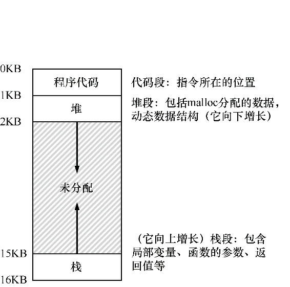

书名：《操作系统导论》

作者：雷姆兹.H.阿帕希杜塞尔；安德莉亚.C.阿帕希杜塞尔


内容概要：本书以对话的形式，围绕着虚拟化Virtualization、并发Concurrency和持久性Persistence三大主题，介绍了现代操作系统的主要组件，包括调度、虚拟内存管理、磁盘和IO系统、文件系统等。

## 第1章：关于本书的对话

###### Q：为什么说操作系统是三个简单的部分（Three Easy Pieces）？
A：著名物理学家理查德费曼曾经写过一本物理学讲义，取名为《Six Easy Pieces》。作者学习费曼的思维方式，也将操作系统领域的知识分为三个部分，即虚拟化、并发和持久性。

###### Q：为什么要用对话的形式讲述知识？
A：其实用对话的形式讲授知识，是一种优良传统，两千多年前的圣贤们，比如孔子、佛陀、苏格拉底等人就是用对话的形式为他们的弟子们讲课。用对话的形式首先能够避免信息失真，而且便于讨论的环境更能引导学生进行思考，而不是机械式的吸收知识。作者在书中说道，“他觉得有时候将自己从叙述中抽离出来，然后进行思考更有用，这些对话就是思考。”

## 第2章：操作系统介绍

###### Q：程序运行时会发生什么？
A：执行指令。程序先从内存中取出（第）一条指令，解码，然后执行它。根据指令类型，可能简单运算，比如加法，访问内存，跳转到函数等。执行完本条指令后，再取出一条指令，执行，直至所有指令都被执行。

###### Q：操作系统的作用是什么？
A：想象一下，如果为了运行一个程序，我们既要操作内存空间，还要处理其他设备，还要编写具体的程序逻辑，是不是非常复杂且低效？当然是，这会大大限制计算机的用处。操作系统的存在，就是为了让程序编写、运行变得更简单容易，提高效率，增加产出。

######  Q：让操作系统易于使用的一种方法就是虚拟化，那虚拟化是什么呢？
A：简单来说，**虚拟化就是将物理资源（内存、磁盘、处理器）转换为一种更加通用、更强大、且易于使用的虚拟形式**。为了让程序员能够高效利用资源，操作系统会提供一些接口API，供其使用，这些接口也被称为系统调用（system call）或者标准库（standard library）。

#### 2.1 虚拟化CPU

在硬件的支持下，操作系统能够将单个CPU模拟成多个CPU，从而让程序看似在同时运行。

#### 2.2 虚拟化内存

 每个进程都访问属于自己独立的私有地址空间，有时候也称为地址空间（address space），它们之间不会互相影响彼此，这是由于操作系统以某种方式映射到实际的物理内存中了。看似相互独立、互不影响彼此的私有地址空间，实际上共享一段物理内存的方式就是虚拟化内存。

#### 2.3 并发

并发用来指代一系列问题，这些问题在同时处理很多事情且必须解决。比如操作系统同时运行多个程序，同一个程序中有多个线程同时运行等等。

#### 2.4 持久性

在物理内存中，一旦断电或者系统奔溃，所有的数据都会丢失。因此为了解决这个问题，就必须想办法把数据（包括指令、代码）持久地存储起来。

# 第一部分：虚拟化

## 第4章 抽象：进程

#### 4.1 概念

进程的非正式定义：运行中的程序。

###### Q：如何提供有多个CPU的假象？
A：时间是宝贵的。每个人都希望在一台机器上同时运行多个程序，来节省时间，完成作业。但CPU是有限的，个人电脑一般有不超过4个CPU，这远远少于要运行的程序数量。为了解决这个问题，操作系统采用了称之为“**时分共享**”的CPU技术。简单来说，就是把单个CPU的运行时间划分为很多个细小的片段，让每个程序只占用其中的一个片段，一个程序在属于自己的时间片段执行完之后，切换到下一个程序，以此类推，好像每一个程序都在**独占**CPU一样。

###### Q：既然进程就是运行的程序，那么具体一点，进程都包括哪些部分呢？
A：为了理解进程是什么，我们必须理解它的机器状态，即程序在运行时可以读取和更新的内容。及其状态包括：

- 内存。运行的程序必然会从内存中读取数据和指令，并将某些数据写入内存中。
- 寄存器。许多指令会明确地读取或更新寄存器。这里还有一些特殊的寄存器，比如PC（Program Counter）程序计数器，有时候也叫IP（Instruction Pointer）指令指针，指向当前正在运行的指令；栈指针和帧指针管理函数参数栈、局部变量和返回地址。

#### 4.2 进程API

- 创建Create
- 销毁Destroy
- 等待Wait，有时候等待进程停止运行是有用的
- 状态Status，比如运行了多长时间，或者处于什么状态

#### 4.3 创建和运行的细节

###### Q：操作系统如何启动一个程序？
A：首先，需要将保存在磁盘上的可执行程序代码加载到内存中，包括代码和静态数据。在早期的操作系统中，加载过程会尽早完成，即在程序运行之前必须被全部完成加载。但现在操作系统为了提高加载速度，选择按需加载。接着，会为程序的栈分配一些内存，在C语言中，局部变量、函数参数和返回值都是保存在栈中。同时，还会为程序的堆分配一些内存，堆用于显式请求的动态分配数据，在C语言中用`malloc()`申请，用`free()`释放。然后，还会初始化一些任务，特别是I/O相关的，在UNIX系统中，默认有三个打开的文件描述符，分别用于标准输入、输出和错误。最后，程序启动，从入口`main()`函数执行，OS将控制权交给当前进程。

#### 4.4 状态

一个进程可能处于下面三种状态之一。

- 运行（running）：正在执行指令。
- 就绪（ready）：进程已准备好，但由于某种原因不在此时运行。
- 阻塞（blocked）：一个进程执行了某种操作，直到其他事情发生时才能准备运行。比如进行I/O请求时。

## 第6章 机制：受限直接执行

为了让多个进程能够（看起来）独占有限的CPU资源，OS采用了时分共享（time sharing）的技术，为每一个进程分配一个时间片，用完之后切换到下一个进程，以此类推。这里在细节上有两个问题需要解决：

- 如何确保用户进程不会恶意执行某些代码，从而保护系统的可用性和完整性。同时，又支持用户进程执行某些特殊操作（可能危害系统），比如I/O、创建子进程等。
- 如果用户进程占用CPU，OS自然不会被运行，那么如何让OS一直对所有资源拥有控制权。

###### Q：如何保证系统的稳定性，同时保证系统的多用性？
A：硬件会提供两种模式，**用户模式（user mode）**和**内核模式（kernel mode）**。所有OS之上的应用程序都运行在用户模式，在此模式中，只能运行受限的指令，主要是为了避免可能的失误和错误，保证系统的稳定性。像访问文件系统、创建和销毁进程、和其他进程通信，以及分配更多内存等特殊操作不能在用户模式下执行，只有其他常规操作才可以执行。OS运行在内核模式下，可以执行所有操作，包括上面这些受限的操作。但是，在应用程序中可以通过**系统调用**，让硬件从用户模式转向内核模式，从而让用户进程执行被受限的操作。

###### Q：进程从用户模式转向内核模式时，都做了哪些工作？
A：执行系统调用时，程序必须执行特殊的陷阱指令（trap instruction）。执行陷阱指令时，会保存当前运行进程的寄存器状态等重要信息，以便执行从陷阱返回指令时能够恢复到原有状态。例如在X86体系中，处理器会将PC、标志和其他一些寄存器状态保存在每个进程的**内核栈**上。这些陷阱指令保存在**硬件的特殊位置**（早在OS启动时就会设置好），而且除过正常的系统调用还有多种类型，比如某些异常情况发生时，硬件、键盘中断发生时，都对应不同的陷阱指令，这就要求用一个叫做**陷阱表（trap table）**的结构来保存。

*受限直接运行协议*

|步骤|操作系统@运行（内核模式）|硬件||
|:-:|:--|---|---|
|01|初始化陷阱表|||
|02||记住系统调用处理程序的地址||
|03|操作系统@运行（内核模式）|||
|04|在进程列表上创建标目<br />为程序分配内存<br />将程序加载到内存中<br />根据argv设置程序栈<br />用寄存器、PC填充内核栈<br />从陷阱返回|||
|05||从内核恢复寄存器<br />转向用户模式<br />跳到main()函数||
|06|||运行main()函数<br />……<br />运行系统调用<br />陷入操作系统|
|07||将寄存器保存到内核栈<br />转向内核模式<br />跳到陷阱处理程序||
|08|处理陷阱<br />进行系统调用的工作<br />从陷阱返回|||
|09||从内核栈恢复寄存器<br />转向用户模式<br />跳到陷阱之后的PC||
|10|||……<br />从main()返回<br />通过exit()陷入内核|
|11|释放进程占用的内存<br />从进程列表中清除|||

###### Q：如何保证在进程之间切换时，还能对系统资源持有控制权？
A：有两种方法可以解决这个问题。在早期版本中，OS相信进程会合理运行，在一段时间之后会将控制权返回。OS会通过系统调用，或某些非法操作，重新获得CPU的控制权。这是协作式的，OS显得有点被动。在非协作式中，通过**时钟中断**让OS重新获得控制权。时钟设备每几毫秒产生一次中断，产生中断时，当前正在运行的进程停止，OS中预先配置的中断处理程序（interrupt handler）会运行，这时OS会获得控制权，停止当前进程，启动另一个进程。interrupt handler和陷阱指令一样，都是由硬件提供的，在OS启动时就要设置好。

###### Q：OS叫停一个进程，同时启动另一个进程的过程中，还要执行哪些额外操作？
A：为了让停止的进程还能正常运行，OS有责任保存下进程的所有状态信息，例如通用寄存器状态值，PC，内核栈指针，到进程控制块PCB中。这样当进程再次启动时，就可以恢复这些状态信息，继续执行。这就是上下文切换，上下文即进程的所有状态（环境）信息。为了高效，会用汇编语言写成。

###### Q：受限直接执行到底是什么？
A：受限直接执行（limited direct execution）是实现CPU虚拟化的关键底层机制，它的思路很简单，就是程序在CPU上执行，但首先要设置好硬件，以便在没有OS帮助的情况下限制进程的可执操作。

## 第7章 进程调度：介绍

###### Q：何为调度？
A：调度也可称为选择，指在某个时候选择一个进程，让其占用CPU，运行指令获得结果。

###### Q：调度策略的指标都有哪些？
A：周转时间：任务完成到任务达到系统之间所用的时间，这是一个**性能指标**。响应时间：任务首次运行到任务达到系统之间的时间，这是一个**公平指标**。

###### Q：常见的调度策略都有哪些？
A：如下所示。

- 先进先出（FIFO），也叫先到先服务；
- 最短任务优先（Shortest Job First，SJF），条件是要知道任务执行所需要的时间长短，一般不可知；
- 最短完成时间优先（Shortest Time-to- Completion First，STCF），每当新工作进入系统时，它会确定剩余工作和新工作中，谁的剩余时间最少，然后调度该工作。
- 轮转（Round-Robin，RR），在一个时间片（time slice）内只运行一个工作，当前时间片用完之后切换到队列的下一个任务，反复执行，直到所有任务完成。这种方式能够提高响应时间。

## 第8章 调度：多级反馈队列

###### Q：FIFO、SJF、STCF、RR等调度策略虽然都能工作，但都存在很大的问题，原因就是它们考虑的指标都太单一，不能很好地解决现实世界中的复杂情况。那还有什么好的策略没？
A：多级反馈队列（Multi-Level Feedback Queue，MLFQ）就是一个不错的策略，该调度算法经过多年的优化，出现在许多现代操作系统中。

###### Q：MLFQ都有哪些规则呢？
A：总体上而言，**MLFQ通过观察将所有任务按照优先级分组，高优先级的任务先执行，低优先级的任务后执行，并随着任务的运行，根据反馈的指标信息动态调整优先级的一种方法**。具体包括：

- 规则1：如果A的优先级 > B的优先级，则运行A；
- 规则2：如果A的优先级 = B的优先级，则轮转运行A和B；
- 规则3：新任务达到时，放在最高优先级；
- 规则4：一旦工作用完了在一层中的时间配额（无论中间主动放弃了多少次CPU），就降低其优先级；
- 规则5：经过一段时间S，就将系统中所有工作重新加入最高优先级队列。

## 第12章 关于虚拟内存的对话

###### Q：何为虚拟内存？
A：每台计算机都有一块连续的物理内存，当程序运行时，程序的代码和数据就是保存在这些物理内存中的。但让程序直接操作物理内存，一方面会很复杂很低效，另一方面某个进程可能恶意操控其他进程的内存，从而造成进程异常。为了解决这些问题，OS需要提供一套方案，让每个进程的内存操作变得简单易用，同时提高安全性，这就是虚拟内存技术。虚拟内存会给进程一种假象，认为自己占用了大量私有内存，甚至全部内存，借助操作系统和硬件的帮助，会把虚拟内存地址转换为真实的物理内存地址，从而找到想要的数据。

## 第13章 抽象：地址空间

###### Q：在时分共享系统中，面临的最大问题是什么？
A：在时分共享系统中，虽然多个程序在各自的时间片内运行，但它们的代码和数据简单地放在一起（同一块内存上）。这样，就很容易造成一个程序读取其他程序的内存，甚至（恶意）修改，造成程序奔溃。

###### Q：通过将物理内存抽象为地址空间（address space），可以有效解决上述问题。地址空间是如何工作的？
A：一个进程的地址空间包含程序运行时的所有内存状态，具体可以分为三个部分：

- 程序代码，用来保存程序的指令（代码）；
- 栈，保存函数调用信息，分配空间给局部变量，参数和返回值。一般放在底部，会向上增长；
- 堆，用来管理动态分配的、用户申请的内存，像C语言中调用`malloc()`或其他语言中的`new()`时获得的空间。一般放在顶部，向下增长。



###### Q：虚拟内存系统是为了让OS更安全、更好用，它有哪些要求呢？
A：有三个要求，分别是：

- 透明。OS实现虚拟内存的方式，不应该让上层的应用程序感受到。
- 效率。从虚拟内存到物理内存的转换要高效。实际上，这需要硬件上的支持。
- 保护。每个进程的虚拟内存空间之间应该被隔离，以防止出错或恶意程序的影响。

## 第14章 插叙：内存操作API

###### Q：在一个C程序中，一般会用到哪两种内存？
A：栈内存和堆内存。栈内存的申请和释放是由编译器隐式管理的，或自动管理。堆内存的申请和释放都是由程序员显式管理的，这是困难的，稍有不慎就会出错。

```c
void func() {
    int x;  // stack
    int *y = (int *)malloc(sizeof(int));    // heap
}
```

###### Q：`malloc()`和`free()`函数的使用技巧都有哪些？
A：`malloc()`接受不了一个表示空间大小的int参数，返回一个void指针。一般用`sizeof()`函数获得需要分配的内存大小，如果是字符串，请使用`malloc(strlen(s)+1)`作为参数；void指针一般要通过强制类型转换（cast）以对齐目标类型。`free()`很简单，只需要传入要释放的变量即可，因为OS会记录所有已分配变量的大小。

###### Q：何为内存泄漏，危害有哪些？
A：如果程序员忘记释放手动申请的内存，就会造成内存泄漏。对于一个长时间运行的系统来说，缓慢的内存泄漏是致命的，因为当大量内存不可用时会造成内存不足的问题，这时程序就不得不退出重新启动。

## 第15章 机制：地址转换

###### Q：如何高效、灵活地虚拟化内存？
A：利用基于硬件的地址转换技术（hardware- based address translation），简称地址转换。借助硬件的帮助，通过地址转换，对每次内存访问进行处理时（获取指令、读取数据、写入数据），会将指令中的虚拟地址转换为实际存储数据的物理地址，以获得真正的数据和指令并进行真正的操作。

###### Q：地址转换听起来很简单，具体的过程时怎样的？
A：在实际的转换过程中，会利用CPU提供的两个寄存器【基址寄存器（base）和界限寄存器（bound）】来实现。**实际的地址 = 基址 + 虚拟地址**，界限寄存器用来检查计算出的实际地址是否在此范围内，如果超出则表示越界，触发异常处理程序。这种方法也被称为**动态重定位（dynamic relocation）**。

*动态重定位+受限直接执行协议*

| 步骤 | OS@运行（内核模式）                                          | 硬件                                                         |                             |
| :--: | :----------------------------------------------------------- | ------------------------------------------------------------ | --------------------------- |
|  01  | 初始化陷阱表                                                 |                                                              |                             |
|  02  |                                                              | 记住以下程序：<br />系统调用处理程序<br />时钟处理程序<br />非法内存处理程序<br />非常指令处理程序 |                             |
|  03  | 开始时钟中断                                                 |                                                              |                             |
|  04  |                                                              | 开始时钟⏰，在x ms后中断                                      |                             |
|  05  | 初始化进程表<br />初始化空闲列表                             |                                                              |                             |
|  06  | OS@运行（内核模式）                                          | 硬件                                                         | 程序（用户模式）            |
|  07  | 为了启动进程A：<br />  创建进程列表条目<br />  为进程分配内存<br />  将程序加载到内存中<br />  设置基址/界限寄存器<br />  从陷阱返回 |                                                              |                             |
|  08  |                                                              | 恢复A的寄存器<br />转向用户模式<br />跳到A最初的PC           |                             |
|  09  |                                                              |                                                              | 进程A运行<br />获取指令     |
|  10  |                                                              | 转换虚拟地址并获取实际指令                                   |                             |
|  11  |                                                              |                                                              | 执行指令                    |
|  12  |                                                              | 如果显式加载/保存<br />  确保地址不越界<br />  转换虚拟地址并执行<br />  加载/保存 |                             |
|  13  |                                                              |                                                              | ……                          |
|  14  |                                                              | 时钟中断<br />转向内核模式<br />跳到中断处理程序             |                             |
|  15  | 处理陷阱<br />调用switch()例程<br />  将A的寄存器保存到PCB<br />  从B的PCB恢复寄存器状态<br />  从陷阱返回 |                                                              |                             |
|  16  |                                                              | 恢复B的寄存器状态<br />转向用户模式<br />跳到B的PC           |                             |
|  17  |                                                              |                                                              | 进程B运行<br />执行错误加载 |
|  18  |                                                              | 加载越界处理程序<br />转向内核模式<br />跳到陷阱处理程序     |                             |
|  19  | 处理本期报告<br />决定终止进程B<br />回收B的内存<br />移除B在进程表中的条目 |                                                              |                             |

## 第16章 分段

###### Q：基于动态加载的地址转换存在一个很严重的问题：因为给每个进程分配的地址空间是一样大，但每个进程需要的地址空间却不相同，一些进程必然会有大量内存空间没有被利用，同时一些进程不够用，造成浪费。该如何解决这个问题呢？
A：这样的结果也很好理解，因为内存空间分配的粒度太大了，需要进一步细化内存空间的分配粒度。地址空间有三类进程信息：代码段、堆和栈，内存管理单元（Memory Management Unit，MMU）可以使用**三对基址+界限寄存器**定位它们。这样，就将原来一大块地址空间分为三段。

###### Q：在地址转换过程中，如何知道当前地址属于哪个段呢？
A：一种常见方式是用虚拟地址的前几位标识不同的段，比如有三个段就用前两位来标识，00表示代码段，01表示堆地址段，10表示栈地址段。

## 第18章 分页：介绍

###### Q：虽然分段能够在一定程度上降低内存浪费，但依然存在类似的问题，也就是将空间切分为不同长度之后，同样会出现大小不同的内存碎片，内部碎片和外部碎片。分页能够彻底解决此类问题，那分页的概念是什么？
A：**分页就是将虚拟内存空间切分为固定长度的单元，每个单元是一页。相应地，把物理内存看成定长槽块的阵列，叫作页帧，每个页帧包含一个虚拟内存页**。分页比之前的分段有许多优点：

- 灵活性。通过完善的分页方法，不管进程如何使用地址空间，操作系统能够高效地提供地址空间的抽象。
- 简单性。因为大小固定，而且和物理页帧对应，既让计算最终的物理内存地址简单，也让管理空闲空间变得简单。

###### Q：通过什么方法，能让虚拟页和物理内存之间对应起来？
A：OS通常会为每一个进程保存一个称为**页表page table**的数据结构，让虚拟页和物理页一一对应起来。通常每个进程内需要多个页，为了区分不同的虚拟页，需要将页分成两个组件：

- **虚拟页面号**（virtual page number，VPN），用这个号码在页表中索引物理页帧；
- **页内偏移量offset**，通过VPN找到物理页帧之后，加上offset即为最终物理内存地址。

###### Q：页表存在哪些问题？
A：最大的问题就是占用空间很严重。设想在32位地址空间中，页的大小为4KB，即offset需要12位，那么VPN就需要20位，相当于1MB内存，如果有100个进程在运行，那么就需要400MB内存来保存页表信息，太可怕😨了。而且，将虚拟地址转换为物理地址的计算过程需要很大的工作量，额外的内存引用开销也很大，对程序的性能影响很严重。

###### Q：上面说的**额外引用**是什么意思？
A：为了在虚拟地址和物理地址之间转换，就需要页表这种数据结构来保存它们之间的一一对应关系。因为页表本身也会保存在虚拟内存中，所以要获得某个指令的物理地址，首先需要对保存该指令的页表项进行转换。这样，每次指令的获取、加载或保存都必须进行额外的转换工作。这种方式无法做到高性能。

###### Q：页表作为一种数据结构，用于将虚拟地址映射到物理地址。最简单的形式是线性页表，即一个数组。那么每个页表项PTE都有哪些部分组成？
A：PTE中包含众多位，每个位都表示不同的信息。它们大概包括：

- 有效位（valid bit），用于指示特定地址是否有效，比如在堆栈之间未使用的空间被标记为无效。
- 保护位（protection bit），表明页是否可以读取、写入或者执行。如果以不允许的方式访问页，会陷入OS。
- 存在位（present bit），表示该页是在物理内存上还是在磁盘上（交换空间）。
- 脏位（dirty bit），表示页被带入内存之后是否被修改过。
- 参考位（reference bit，也称为访问为accessed bit），有时追踪页是否被访问过，用于确定哪些页很受欢迎，对于页面替换很重要。

## 第19章 分页：快速地址转换（TLB）

###### Q：为了加速地址转换，又需要硬件——TLB的帮助，TLB是什么？
A：TLB即地址旁路缓冲存储器（translation-lookaside buffer），是频繁发生的虚拟地址到物理地址转换的硬件缓存（cache）。对每次内存访问，硬件先检查TLB，看看是否有期望的转换映射，如果有直接获取，否则另行转换计算，计算完成之后将结果保存在TLB中。

###### Q：TLB能够加速地址转换，是因为借助了缓存数据。（硬件）缓存背后的思想是什么？
A：缓存背后的思想是利用数据和指令的局部性（locality），通常包括时间局部性（temporal locality）和空间局部性（spatial locality）。

- **时间局部性**，最近访问的指令或数据项可能很快会再次访问。比如循环中的变量，就会反复被访问。
- **空间局部性**，当程序访问内存地址X时，可能很快就会访问临近X的内存。比如遍历数组时，就是在访问空间上临近的数据。

###### Q：进程切换时，如何管理TLB的内容？
A：因为TLB中包含的虚拟到物理地址之间的映射只对当前进程有效，对其他进程无效。所以当进程切换时，如果不进行特殊处理，那么必然会大量出现**未命中**的想象，从而影响性能。因此为了提高性能，一些系统增加了硬件支持，实现跨上下文切换的TLB共享，比如在TLB中添加了一个地址空间标识符（Address Space Identifier，ASID），也可以把ASID看成进程ID。这样在地址转换时，就可以通过索引ASID来确定是否为当前进程的页表项。

