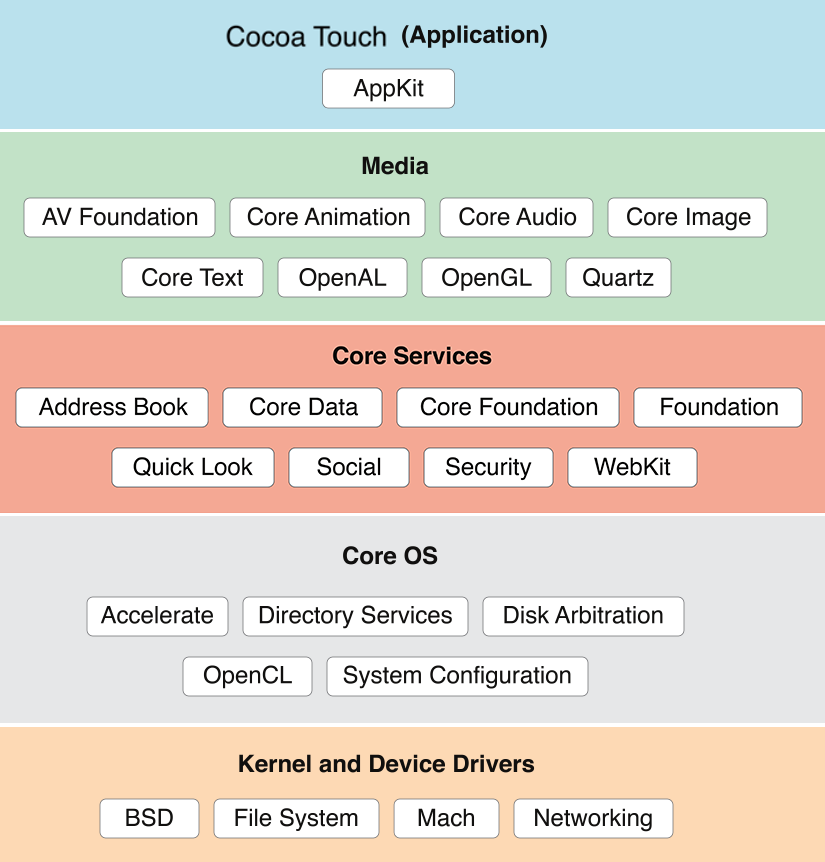
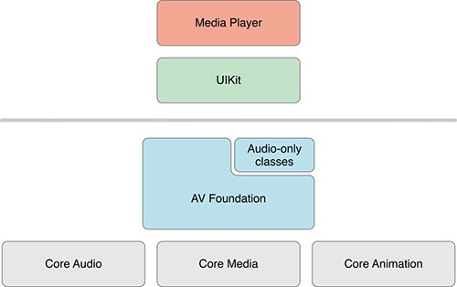
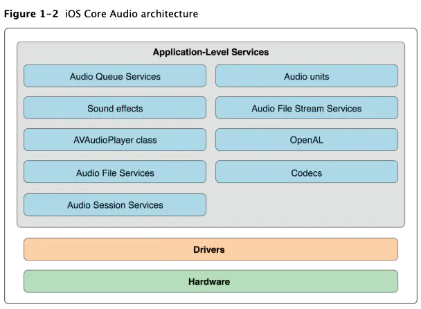

iOS操作系统除过最底层的内核，其上总共分为四层，从上到下依次是：

- 交互层 Cocoa Touch 
- 媒体层 Media 
- 核心服务层Core Services 
- 操作系统层 Core OS

# Cocoa Touch

最上层的Cocoa Touch层直接和用户进行交互，比如最常用的UIKit中的各种控件就属于此层，以及最核心的基础服务Foundation框架，以及地图MapKit等。

- Foundation，Objective-C的核心实现，动态、高效、完备。
- UIKit，内含各种交互控件和手势，比如UILabel、UIButton、UIImageView、UIScrollView，是所有程序必不可少的组成部分。

# Media

Media媒体层为上层的Cocoa Touch提供画图和多媒体服务，比如文字、图像、音视频处理等。

- 文字
    - Core Text，文字渲染
- 图像
    - Core Graphics，也叫Quartz 2D，是Apple所有设备的二维绘图引擎，可以实现颜色空间管理、路径绘制、仿射变换、渐变阴影、PDF相关功能。
    - Core Image，方便易用的图片处理库，内置大量滤镜，特征检测，比如人脸、矩形、文字等，还可以自动优化图片效果。
    - Core Animation，提供高级动画能力，是对Core Graphics和OpenGL的一次封装，具体可分为基本动画、关键帧动画、动画组和转场动画。
    - OpenGL ES，一个跨平台3D渲染引擎，实际上大部分工作是把3D坐标转换为2D像素来实现渲染的。
- 音视频
    - AVFoundation，音视频录制、播放、处理相关，是封装在Core Avdio、Core Media、Core Animition之上的。
    - Core Audio，为iOS和macOS等提供数字音频服务，包含常用的Audio Toolbox和Audio Unit。

# Core Services

核心服务层为Application提供基础的系统服务，比如数据存储框架Core Data、安全服务Security、网络访问CFNetwork等，以及最重要的Foundation和CoreFoundation，它们是Objective-C的核心。

- CFNetwork，网络服务
- Core Data， 数据存储
- Core Location，定位
- Core Motion，重力加速度、陀螺仪
- Webkit，浏览器引擎
- JavaScriptCore，JavaScript解释引擎
- …

# Core OS

核心操作系统层为其上所有层提供最基础的服务，比如内存管理、线程管理、本地认证、文件系统、电源管理等，是底层的硬件和上层各种服务之间的接口。

- 操作系统内核服务，比如BSD sockets、I/O访问、内存申请、文件系统、数学计算等。
- 本地认证，比如指纹识别验证等。
- 安全服务，管理证书、公钥、密钥等的接口等。
- 数学加速 ，比如执行数学、大数字以及DSP运算,这些接口iOS设备硬件相匹配等。
