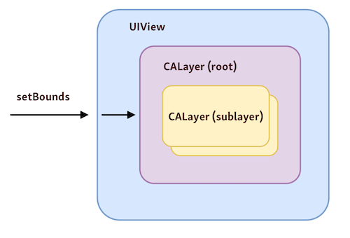

# 概述
Core Animation为iOS系统提供了出色的动画体验。对于开发者来说，不管其是否了解Core Animation，他都会使用到Core Animation提供的能力。

在iOS中，对于界面元素的呈现有两个对象必不可少：`CALayer`和`UIView`，它们之间有相似之处，也有明显的不同。

对于一个APP，直观上使用`UIView`会比较多，因为UIKit中大多数对象都是`UIView`的子类，用来呈现不同的视觉元素。如果一个APP中全用`UIView`及其子类，完全可以实现大多数功能和需求，但如果配合`CALayer`，将能实现更加出色的视觉效果和体验。

但实际上，`UIView`和`CALayer`之间有一定的边界。对于一个视觉元素，它内含了大量的信息，比如大小、位置、颜色、内容等其他视觉特性，这些所有的信息都由`CALayer`管理，当然它还有其他职责，比如缓存视图内容。而`UIView`其实只是对`CALayer`的包裹，也就是说每一个`UIView`后面都有一个`CALayer`，但这并不代表开发者亲自操作`CALayer`就能够带来明显的性能提升。之所以这么做，有一定的历史问题，更重要的原因是在iOS中引入了触摸屏，视图除了呈现视觉元素之外，还多了另一个只能——操作手势交互，而`UIView`就是用来承担手势交互、时间处理等职责的。除此之外，`UIVIew`还要负责布局、绘制、外观等职责。



# Animation

## 动画属性

让某个视觉元素的特定属性在一定时间内动态变化，就是动画。在iOS中，这些属性就来自于`CALayer`，包括：

- anchorPoint
- backgroundColor
- borderColor
- borderWidth
- bounds
- contentRect
- cornerRadius
- frame
- opacity
- position
- transform
- zPosition

详细列表见：[Apple开发者指南：动画属性](https://developer.apple.com/library/archive/documentation/Cocoa/Conceptual/CoreAnimation_guide/AnimatableProperties/AnimatableProperties.html#//apple_ref/doc/uid/TP40004514-CH11-SW4)

## 图层结构
每一个使用Core Animation的App，都有三种图层结构树模型，它们各自承担不同的作用：
- **模型图层树(Model layer tree)**：CALayer的模型结构，它内含所有元素信息，并保存动画的目标值，修改属性出发动画时也作用于此。
- **展现树(presentation tree)**：用来保存当前正在运行的动画的相关属性值，开发者不应该主动修改这些，只能获取。
- **渲染树(render tree)**：执行最终的动画对象，对Core Animation是私有的。


## 动画类型
### CABasicAnimation

如果动画比较简单，只是为了过渡某个属性值的修改，可以使用CABasicAnimation。需要注意的是，在动画结束之后，此属性值并不会变成在动画中设置的，而是后恢复动画之前的原值。所以，如果需要保留动画之后的状态，则需要在其后直接修改属性值。

```objc
CABasicAnimation* fadeAnim = [CABasicAnimation animationWithKeyPath:@"opacity"];
fadeAnim.fromValue = [NSNumber numberWithFloat:1.0];
fadeAnim.toValue = [NSNumber numberWithFloat:0.0];
fadeAnim.duration = 1.0;
[theLayer addAnimation:fadeAnim forKey:@"opacity"];
 
// Change the actual data value in the layer to the final value.
theLayer.opacity = 0.0;
```

### CAKeyframeAnimation

如果需要实现比较复杂的动画效果，关键帧动画CAKeyframeAnimation或许能够派上用场。它能够更加准确的控制动画过程，比如按照具体的路径CGPath移动，并且还能通过时间函数控制速度。

```objc
CGRect boundingRect = CGRectMake(-150, -150, 300, 300);

CAKeyframeAnimation *orbit = [CAKeyframeAnimation animation];
orbit.keyPath = @"position";
orbit.path = CFAutorelease(CGPathCreateWithEllipseInRect(boundingRect, NULL));
orbit.duration = 4;
orbit.additive = YES;
orbit.repeatCount = HUGE_VALF;
orbit.calculationMode = kCAAnimationPaced;
orbit.rotationMode = kCAAnimationRotateAuto;

[satellite.layer addAnimation:orbit forKey:@"orbit"];
```


### CAAnimationGroup

有时候，我们需要将多个动画组合在一起，同时作用于某个对象，这时候就可以用CAAnimationGroup将它们全部包含进去。

```objc
CABasicAnimation *zPosition = [CABasicAnimation animation];
zPosition.keyPath = @"zPosition";
zPosition.fromValue = @-1;
zPosition.toValue = @1;
zPosition.duration = 1.2;

CAKeyframeAnimation *rotation = [CAKeyframeAnimation animation];
rotation.keyPath = @"transform.rotation";
rotation.values = @[ @0, @0.14, @0 ];
rotation.duration = 1.2;
rotation.timingFunctions = @[
    [CAMediaTimingFunction functionWithName:kCAMediaTimingFunctionEaseInEaseOut],
    [CAMediaTimingFunction functionWithName:kCAMediaTimingFunctionEaseInEaseOut]
];

CAKeyframeAnimation *position = [CAKeyframeAnimation animation];
position.keyPath = @"position";
position.values = @[
    [NSValue valueWithCGPoint:CGPointZero],
    [NSValue valueWithCGPoint:CGPointMake(110, -20)],
    [NSValue valueWithCGPoint:CGPointZero]
];
position.timingFunctions = @[
    [CAMediaTimingFunction functionWithName:kCAMediaTimingFunctionEaseInEaseOut],
    [CAMediaTimingFunction functionWithName:kCAMediaTimingFunctionEaseInEaseOut]
];
position.additive = YES;
position.duration = 1.2;

CAAnimationGroup *group = [[CAAnimationGroup alloc] init];
group.animations = @[ zPosition, rotation, position ];
group.duration = 1.2;
group.beginTime = 0.5;

[card.layer addAnimation:group forKey:@"shuffle"];

card.layer.zPosition = 1;
```

### UIViewAnimationWithBlocks

如果为了方便，还可以直接使用UIView提供的基于Block的动画能力。

```objc
[UIView animateWithDuration:1 animations:^{
    self.view.layer.opacity = 0.4;
    self.view.layer.backgroundColor = [UIColor lightTextColor].CGColor;
}];

[UIView animateWithDuration:0.4 animations:^{
    
} completion:^(BOOL finished) {
    
}];

[UIView animateKeyframesWithDuration:0.4 delay:2 options:UIViewKeyframeAnimationOptionLayoutSubviews animations:^{
    CAKeyframeAnimation *ani = [CAKeyframeAnimation animation];
    ani.keyPath = @"position.x";
    ani.values = @[@100, @120, @150, @200];
    ani.duration = 1;
    ani.timingFunction = [CAMediaTimingFunction functionWithName:kCAMediaTimingFunctionEaseInEaseOut];
    [self.view.layer addAnimation:ani forKey:@"keyFrame"];
} completion:^(BOOL finished) {
    
}];
```

# 参考
- [Core Animation开发指南](https://developer.apple.com/library/archive/documentation/Cocoa/Conceptual/CoreAnimation_guide/Introduction/Introduction.html#//apple_ref/doc/uid/TP40004514-CH1-SW1)
- [OjbC中国期刊-12期](https://objccn.io/issue-12-1/)
- [UIVIew vs CALayer](https://fassko.medium.com/uiview-vs-calayer-b55d932ff1f5)