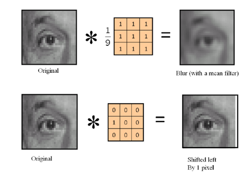

# 简介

Core Image是一个图片处理及分析库，里面封装了非常易用的API，比如大量常用滤镜。因为它借助GPU或者CPU渲染，所以可以接近实时的速度处理静态图片和视频图片，图片可来自Core Graphics、Core Video以及I/O框架。


## 功能列表

Core Image提供的能力包括：
- 通过大量内置滤镜处理图片
- 通过滤镜链自定义处理效果
- 自动化图片增强
- 特征检测，比如人脸、矩形、文字等
- 创建自定义滤镜

## 基本概念
### 滤镜

一个滤镜在语义上表示某种能力，当作用在一张图片上时，可以经过某种变换从而得到另一张图片。

我们都知道，图片在计算机中是以像素为基本单位而保存的像素矩阵，通过图像处理单元GPU才能将其显示在屏幕上。在数学上，滤镜其实也是一个矩阵，也叫卷积核，通常比图片的像素矩阵维度小得多。在真正处理图片时，图片像素矩阵和卷积核做卷积运算，最终输出一个“新”图片。



### 滤镜链

顾名思义，滤镜链就是将多个滤镜链接在一起，前一个滤镜的输出作为下一个滤镜的输入，就像流水线一样，图片从第一个滤镜中进入，处理之后再进入下一个，一直到最后一个滤镜。通过这种方式，可以创建出更加如何需求的效果。

但实际上，Core Image的处理逻辑有点不同，它并不会让一张图片经过多次处理。为了性能考虑，Core Image会先将多个滤镜的卷积核合成为一个，然后一次性得出最终的结果。

# 图片处理

简单来说，图片处理就是将某张图片作用于某个滤镜的过程。

在Core Image中，图片为CIImage，滤镜为CIFilter，为滤镜设置参数要通过KVC实现。同时，还需要一个上下文对象CIContext，里面保存着所有相关的细节。因为这些细节非常多，所以最好在合适的时机创建一个可重复利用的CIContext对象。

## 单滤镜

最基本的用法就是只使用单个滤镜，如下所示。

```objc
- (void)blurImageWithRadius:(CGFloat)radius {    
    UIImage *originalImage = [UIImage imageNamed:@"blackboard.jpg"];
    CIImage *ciimage = [CIImage imageWithData: UIImageJPEGRepresentation(originalImage, .9)];
    
    CIFilter *gaussianBlur = [CIFilter filterWithName:@"CIGaussianBlur"];
    [gaussianBlur setValue:@(radius) forKey:@"inputRadius"];
    [gaussianBlur setValue:ciimage forKey:@"inputImage"];
    
    [self.processedImageView setImage:[UIImage imageWithCIImage:gaussianBlur.outputImage]];
}
```

在CoreImage中所有相关操作中只能使用CIImage这个格式，但是它并不能直接呈现给用户，因为**CIImage只是一种用来生产图片的“配方”，其实就是一种操作流程，比如从URL读取图片文件，某个滤镜操作的输出等，只有在渲染或者输出时才会开始执行**。总结下来，可以通过下面这些方法创建CIImage：

- NSURL
- NSData
- UIImage
- CGImageRef
- CVImageBufferRef
- CIImageProvider

```objc
- (void)createCIImageMethods {
    CIImage *ciimg;
    
    // 1. URL
    ciimg = [[CIImage alloc] initWithContentsOfURL:[NSURL URLWithString:@"some-url"]];
    
    // 2. bytes
    ciimg = [CIImage imageWithData:[NSData dataWithContentsOfFile:@"some-file-path"]];
    
    // 3. UIImage
    ciimg = [CIImage imageWithData:UIImageJPEGRepresentation([UIImage imageNamed:@"some-img-name"], .9)];
    ciimg = [CIImage imageWithData:UIImagePNGRepresentation([UIImage imageNamed:@"png-name"])];
    
    // 4. CGImageRef
    ciimg = [CIImage imageWithCGImage:[UIImage imageNamed:@"some-img"].CGImage];
    
    //...
}
```

## 滤镜分类

Core Image中有大量的滤镜，而且随着系统的不断升级，还在不断添加新的滤镜。系统将它们分为以下这些类别：

|类别名称|说明|例子|
|-|-|-|
|CICategoryBlur|模糊|高斯模糊、降噪等|
|CICategoryColorAdjustment|颜色调整|色值、曝光度、明暗度调整，色温，色调曲线等|
|CICategoryColorEffect|颜色效果|色值转换、黑白效果、褪色等|
|CICategoryCompositeOperation|合成|叠加，颜色混合、差分、乘除，亮度、色度混合等等|
|CICategoryDistortionEffect|扭曲|隆起、线性隆起，德罗斯特效应，替换扭曲，玻璃扭曲等|
|CICategoryGenerator|生成器|生成条形码、二维码、星光🌟、日光，纯色图片、随机图片等|
|CICategoryGeometryAdjustment|几何变换|仿射、透视变换，剪裁，兰索斯缩放|
|CICategoryGradient|渐变|高斯渐变、线性渐变、径向渐变等|
|CICategoryHalftoneEffect|网版效果|圆形网屏，点状网目板等
|CICategoryReduction|不知道该如何翻译|区域平均值、最值，行、列平均值等|
|CICategorySharpen|锐化|亮度锐化、非锐化蒙版|
|CICategoryStylize|风格化|蒙版混合，软化边缘，喜剧效果，卷积，结晶，边缘检测等|
|CICategoryTileEffect|铺贴效果|以多种不同形式填充图案等|
|CICategoryTransition|过渡|条形过渡，溶剂过渡等|

把这些功能组合在一起，基本可以实现一个Photoshop了。

## 滤镜链

前面说了，当要经过多个滤镜的处理时，CoreImage为了提高性能会将多个滤镜合成为一个，并在合适时机完成处理。

例如，如果分步处理，其流程如下：


但如果合成为一个Filter，则其流程如下：


```objc
- (CIImage *)processWithImage:(CIImage *)image fileterName:(NSString *)name params:(NSDictionary *)params {
    CIFilter *filter = [CIFilter filterWithName:name];
    [filter setValue:image forKey:@"inputImage"];
    for (NSString *key in params.allKeys) {
        [filter setValue:params[key] forKey:key];
    }
    return filter.outputImage;
}

- (IBAction)startProcessWithChain:(UIButton *)sender {
    CIImage *blurImg, *bloomImg, *croppedImg;
    blurImg = [self processWithImage:self.inputImage
                         fileterName:@"CIGaussianBlur"
                              params:@{kCIInputRadiusKey: @(1.2)}];
    bloomImg = [self processWithImage:blurImg
                          fileterName:@"CIBloom"
                               params:@{kCIInputRadiusKey: @(8.0),
                                        kCIInputIntensityKey: @(1.0)}];
    croppedImg = [bloomImg imageByCroppingToRect:CGRectMake(50, 100, 300, 300)];
    
    [self.processedImageView setImage:[UIImage imageWithCIImage:croppedImg]];
}
```

## 常用操作

Core Image除过用**CFilter**来处理图片外，还可以通过一些预定义的方法直接处理图片，将更加简便。比如：

- `initWithColor:` 纯色图片
- `imageByApplyingTransform:` 给图片进行仿射变换
- `imageByCompositingOverImage:` 叠加图片
- `imageByCroppingToRect:` 剪裁图片
- `imageByClampingToRect:` 扩展边界
- `imageByInsertingIntermediate` 插值

## 检测

在图片识别处理中，如果要识别特定对象，一般都要先进行轮廓检测，然后再根据轮廓剪裁后识别物体，这样会更加高效准确。比如人脸、矩形等对象的识别。在Core Image中，提供了开箱即用的轮廓检测功能，其中只能进行三类操作：人脸、矩形、文字。下面看看人脸检测的使用方法：

```objc
- (void)detect:(UIBarButtonItem *)sender{
    CIImage *image = [CIImage imageWithData:UIImageJPEGRepresentation(self.image, .95)];
    NSLog(@"image size: %@", NSStringFromCGSize(self.image.size));
    CIContext *context = [CIContext context];
    NSDictionary *options = @{CIDetectorAccuracy: CIDetectorAccuracyHigh};
    CIDetector *detector = [CIDetector detectorOfType:CIDetectorTypeFace context:context options:options];
    options = @{CIDetectorImageOrientation: [[image properties] valueForKey:(NSString *)kCGImagePropertyOrientation]};
    
    NSArray *features = [detector featuresInImage:image options:options];
    
    for (CIFaceFeature *feature in features) {
        NSLog(@"face bounds: %@", NSStringFromCGRect(feature.bounds));
        [self drawBorderWithFaceFeature:feature];
    }
}

- (void)drawBorderWithFaceFeature:(CIFaceFeature *)feature{
    CGRect frame = [self convertFaceBoundsToView:feature.bounds];
    NSLog(@"converted face bounds: %@", NSStringFromCGRect(frame));

    UILabel *label = [[UILabel alloc] initWithFrame:frame];
    label.backgroundColor = [UIColor clearColor];
    label.layer.borderColor = [UIColor redColor].CGColor;
    label.layer.borderWidth = 2.f;
    [self.imageView addSubview:label];
}

- (CGRect)convertFaceBoundsToView:(CGRect)bounds{
    CGFloat ratio = CGRectGetWidth(self.imageView.bounds)/self.image.size.width;
    return CGRectMake(CGRectGetMinX(bounds)*ratio, CGRectGetMinY(bounds)*ratio, CGRectGetWidth(bounds)*ratio, CGRectGetHeight(bounds)*ratio);
}

```

经过使用发现，只要当图片中含有少量人时结果比较准确，当图片清晰度降低、并且人较多时结果不一定准确。

## 注意点

为了提高应用程序的性能，在使用Core Image时尽可能注意以下细节：

- 不要每次都创建CIContext，应尽可能复用；
- 如果没有必要，避免动画和颜色空间管理；
- 尽可能使用更小的图片、简单的滤镜；
- 确保不要超过CPU或者GPU的限度等。

# 参考
- [Apple官方文档](https://developer.apple.com/library/archive/documentation/GraphicsImaging/Conceptual/CoreImaging/ci_intro/ci_intro.html)
- [CoreImage滤镜文档](https://developer.apple.com/library/archive/documentation/GraphicsImaging/Reference/CoreImageFilterReference/index.html)
- [ObjC中国期刊21-6](https://objccn.io/issue-21-6/)
