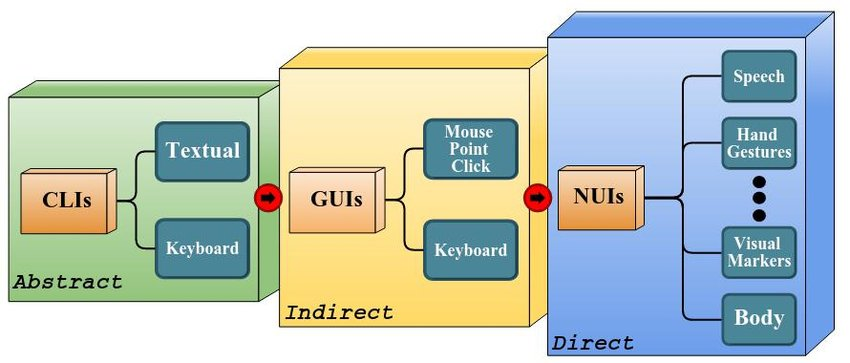
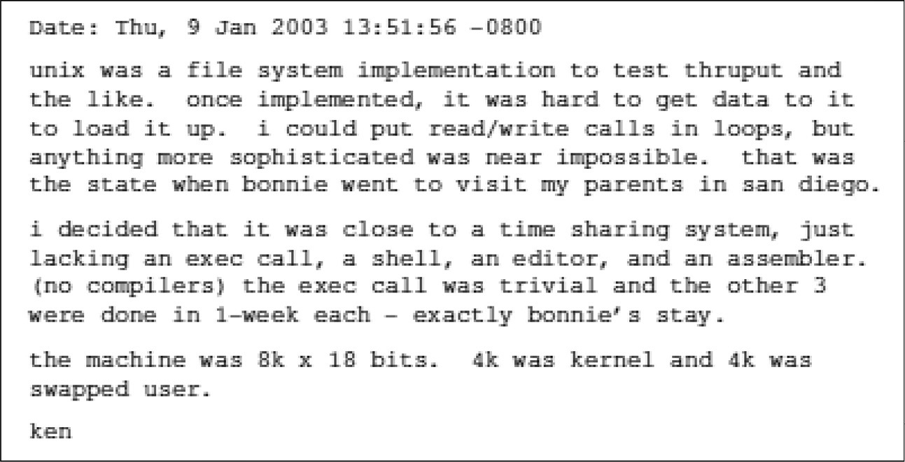
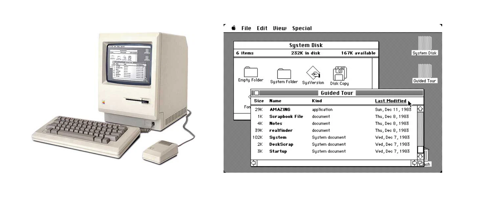

# 人机交互

从上世纪70年代开始，电子计算机的发展趋势逐渐从大型机转向小型机，以及个人计算机。这种转变的一个直接结果是计算机的消费群体在变化，从之前的专业人士变为普通人士。在这时候，计算机研发人员就要思考一个问题：**如何让普通消费者也能够使用它**？

在70年代后期，比尔·莫格里奇提出了**人机交互**的概念，即**定义、设计人造物的行为的设计领域，这里的人造物包括各种生活用品、工业产品和各种软硬件，现在主要应用于计算机及互联网产品领域**。

从人机交互这一概念提出到现在，一共经历了三个阶段：

- **抽象**的命令行界面CLI（Command Line Interface）
- **间接**的图形用户界面GUI（Graphic User Interface）
- **直接**的自然用户界面NUI（Natural User Interface）



## CLI

从1946年第一台电子计算机诞生，到1979年乔布斯参访施乐PARC研究中心之前，**命令行**几乎是人和计算机交互的唯一途径。那个时候，可使用的软件还很少，计算机操作系统最重要的两部分为**Kernel**和**Shell**，前者即操作系统的内核，后者即计算机的访问入口——命令行，到现在它依然保留在每一台计算机中。

> “在某一时刻，我发现离实现一个操作系统仅有3周之遥了。”他需要写三个程序，每周写一个：用来创建代码的编辑器；将代码转换为PDP-7能运行的机器语言的汇编器；再加上“内核的外层——操作系统齐活了”。
>
> 正在那时，肯的太太休了3周假，带着一岁大的儿子去加利福尼亚探望公婆，这样肯就有了3周不受打扰的工作时间。正如他在2019年一次采访中所说，“一周，一周，再一周，我们就有了Unix。”无论以何种方式来度量，这都体现了真正的软件生产力。
>
> —— 布莱恩·W.克尼汉 《UNIX传奇：历史与回忆》



CLI自始至终都很有用，也很强大，但需要记忆才能掌握。这是反人性的，注定只能是少数人的专长。

## GUI
### 历史

在1968年的IEEE会议上，道格拉斯展示了世界上第一只鼠标，并提出了**图形用户界面(GUI)**的概念。

这让施乐公司很是惶恐。为什么呢？因为施乐公司在当时主要经营生产和销售复印机。一旦无纸化办公，这些东西被虚拟化为软件，施乐公司自然就会没有生意可做。

于是施乐公司决心掌握道格拉斯所提出的新技术，并马上成立了**帕络阿尔托研究中心（PARC）**，主要研究和发明计算机技术。那个时候，PARC集结了顶尖的计算机精英。到1973年，第一台通过图形实现人机交互的电脑在施乐问世。

1979年，乔布斯受邀参访施乐，他见到当时的WIMP（Window-Icon-Menu-Pointer）系统，认为非常惊艳，不久之后就领导苹果研发了新一代Macintosh系统，在1984年推出后，造成GUI系统的首次风行。后来，比尔盖茨也将WIMP引入Windows系统，并让GUI发扬光大。



### 焦点系统
#### 桌面设备

当在计算机中引入GUI系统之后，其操作界面就不再像Shell一样简单了，它有了层级结构，包括父子关系和兄弟关系，这就是**窗口系统**。这时候，交互就变得复杂得多了。

不管是哪种输入设备，像鼠标和键盘，一旦触发一个事件，操作系统要能够知道它是发给哪个窗口的，或者哪个进程的，这就需要GUI系统来解决。简单来说，它需要**一种机制来明确当前交互事件是发送给哪个进程的，以便操作系统再将其转发过去让其处理**。

具体是如何决定的呢？其实也简单，就是**看哪个窗口离我们最近**。一般来说，当多个窗口或者视图堆叠在一起的时候，上面的会覆盖住下面的，这很自然。同时，因为计算机屏幕通常面向我们，所以在上面的窗口也就离我们更近一点。离我们最近的窗口，称之为**主窗口**，或者**焦点窗口**，表示接收来自输入设备的事件。

但是，事情并没有这么简单。比如在桌面操作系统Windows和Mac中，就存在**热键**的概念，表示即使某个窗口不是焦点窗口，它依然能够接收事件，通常是来自键盘的事件。使用的最多的应该是截图功能。

另外，GUI系统除过要解决如何在多个窗口中选择焦点窗口的问题，还要解决在同一个窗口内的所有可接收键盘事件（输入字符）的视图之中选择焦点视图的问题。最常见的场景是在登录界面，一个用户名输入框，一个密码输入框，在不同时机如何选择焦点输入框。通常，先默认将焦点放到用户名输入框上，等用户输入完成之后，他自己用鼠标将焦点移到密码输入框中，或者通过按`Tab`键移到下一个输入框中。更加人性化的做法是，在用户名输入完成只有，自动将焦点移到密码输入框中。

#### 移动设备

在移动设备中，焦点系统因为设备屏幕变小而有所简化。不管是在iOS系统，还是Android系统，在一般情况下，默认都只有一个应用程序完全占据设备屏幕，即前台应用，接收来自用户的交互事件；其他应用程序都会自动退到后台，暂停接收来自用户的交互事件。外在约束带来良好的秩序感。

所以，在移动设备的焦点系统中，只需要解决前台应用内的输入焦点的选择问题，这让问题变得简单多了。

在iOS系统中，对于任何`canBecomeFirstResponder`属性为`true`的UI组件，即可获得输入焦点的UI组件，只要调用`becomeFirstResponder()`方法，就会让其变成第一响应者，即焦点视图，开始接收来自键盘的输入事件，同时会让之前的焦点视图失去焦点。通过调用`resignFirstResponder()`也可主动让其失去焦点，不接受键盘输入事件。

#### Web

Web浏览器作为屏蔽了不同操作系统接口之后构建的一个全新的操作系统，它自己也实现了一套焦点系统，来解决同样的问题。浏览器抽象出的API同样很简单，只有两个：

- `document.someElement.focus()` 如果这个Element可以获得焦点，那么在调用此API之后，它就会获得焦点，开始接收的事件。
- `document.someElement.blur()`  不管这个Element能不能获得焦点，调用此API之后，都会失去焦点，暂停接收事件。

```html
<input type="text" id="myTextField" value="Text field.">
<p></p>
<button type="button" onclick="focusMethod()">Click me to focus on the text field!</button>
```

调用下面的方法，就能让`myTextField`输入框获得焦点。

```js
focusMethod = function getFocus() {
  document.getElementById("myTextField").focus();
}
```

## NUI

在第三次人工智能发展浪潮中，**语音识别**技术的突破带来了新的人机交互方式，即通过自然语言让机器理解人的意图，并完成用户期待的任务。

目前，使用场景最多的在智能音箱产品中，作为用户的数字助理角色而存在，当下可以完成的行为包括：简单问答、播放歌曲、打电话、购物等。这些任务相对来说，还都算简单，因为场景很明确。而为什么不能完成复杂任务的主要原因在于，虽然机器已经能够听懂自然语言，但还不能完全理解自然语言，因为机器缺乏我们人类所拥有的**大量常识**。

所以，当下的NUI还只能在既定场景中存在，它的特点是自然流畅，反应迅速，准确率不高。或许，等到**自然语言处理**技术取得重大突破，同时计算机拥有大量人类常识之后，NUI会大放异彩。

# Focus Engine
## Overview

在tvOS上，焦点系统变成其唯一的交互方式，因为TV不能够和iPhone和iPad一样，通过**触摸屏**进行用户交互，也不能像PC和Mac一样，通过**鼠标**和**键盘**进行交互，所以只能通过一种间接方式——**焦点系统（引擎）**来进行交互。

在UIKit内，用来**控制焦点和焦点移动**的系统称之为Focus Engine。

在UIKit框架中，已经为很多UI组件提供了焦点支持，在任何有意义的场景中会自动呈现出来对应的能力。在UIKit中，支持焦点行为的组件包括：

* UIButton
* UIControl
* UISegmentedControl
* UITabBar
* UITextField
* UISearchBar (although UISearchBar itself isn’t focusable, its internal text field is)
* collectionView(_:canFocusItemAtIndexPath:)
* tableView(_:canFocusRowAtIndexPath:)

但是，**Focus Engine并不允许我们直接设置焦点视图，以及焦点移动的方向**。

> You can ask for focus updates programmatically but cannot set focus or move focus in a certain direction.
>
> Only the focus engine can explicitly update focus, meaning there is no API for directly setting the focused view or moving focus in a certain direction.

可控制焦点行为的设备包括：

- 遥控器 Remote
- 游戏控制器 Game Controller
- 模拟器 Simulator

焦点的移动方向为线性，包括：

- 上、下、左、右
- 对角线（需要硬件支持）

触发焦点更新的方式包括：

- 用户主动触发某个事件
- 系统请求更新
- 应用程序请求更新

## Implementation
### UIFocusEnvironment

`UIFocusEnvironment`协议是Focus Engine和应用程序交互的重要入口，它为视图定义了聚焦行为。在UIKit中，具有类容器属性的视图对象都会遵循这一协议，包括UIView、UIViewController、UIWindow等。

我们只需要在控制器或者视图中重写`UIFocusEnvironment`，就可以控制应用程序的聚焦行为。

### 如何决定下一个焦点

当用户主动发起一次事件交互之后，Focus Engine需要先找到下一个可被聚焦的元素，然后通过一段动画过程将焦点传递下来，并更新**lastFocusItem**属性，至此本次交互事件才算完成。包含两个过程：

- 在应用程序的当前可视区内，在焦点移动的方向上，选择下一个（距离最近）可聚焦元素。
- 通过`shouldUpdateFocusInContext:`**验证**此次交互是否需要真正被执行。如果包含`previousFocusedItem`和`nextFocusedItem`的任意环境返回了`No`，那么此事件会被取消。


### 初始焦点

顾名思义，初始焦点就是应用程序在启动时应该选择哪一个UI元素作为焦点的问题。

也就是说，需要一种机制从整个视图层级树中选择一个UI元素，作为首个可聚焦的元素，让Focus Engine顺利启动起来。通常，它会按照**深度优先**搜索算法，找出位于左上角层级最深的第一个可聚焦UI元素，作为初始焦点。

### 优先焦点链

虽然在没有额外设定的情况下，Focus也能按照算法找到一个合适的**初始焦点**，但这个过程有点低效，同时缺乏灵活性。

为了解决这个问题，`UIFocusEnvironment`协议中增加了`preferredFocusedView`属性，用来指定在初始状态，或者手动调用`setNeedsFocusUpdate`强制更新Focus Engine状态时，需要聚焦那一个具体UI元素。

通过`preferredFocusedView`决定初始焦点的过程大致如下：

- Focus Engine -> keyWindow: root view controller
- root view controller: view
- view: some view A from all subviews
- some A: other view from its subviews
- ...
- eventual focused view: return `self` or `nil`

可以看见，通过`UIFocusEnvironment`的`preferredFocusedView`属性值，一层一层往下搜索的过程中，形成的链条就是**优先焦点链Preferred focus chain**。


### 焦点更新

在Focus Engine中，一共有三种方式可以更新焦点状态：

- 用户主动触发的交互事件
- 系统行为导致的更新
- 调用API导致的更新

#### 主动触发

当通过遥控器等硬件触发一次用户交互之后，或者在模拟器上通过键盘触发一次用户行为之后，Focus Engine自然会进行一次焦点更新操作。这是使用频率最高的一种场景。

#### 系统行为

在某些场景中，Focus Engine会自动进行焦点更新操作，以同步系统状态和行为。比如：

- 当前的焦点视图被移除
- `UICollectionView`或`UITableView`重新加载数据
- 一个新的ViewController入栈，显示在最上层

#### API

在程序中，通过调用API更新系统行为和内部状态是一个系统的**完备性**的重要体现。在Focus Engine中，提供了两个重要的API用来实现此功能。
```swift
/// Marks this environment as needing a focus update, which if accepted will attempt to reset focus to this environment, or one of its preferred focus environments, on the next update cycle. If this environment does not currently contain the focused item, then calling this method has no effect. If a parent of this environment is also requesting focus, then this environment's request is rejected in favor of the parent's.
func setNeedsFocusUpdate()

/// Forces focus to be updated immediately. If there is an environment that has requested a focus update via setNeedsFocusUpdate, and the request was accepted, then focus will be updated to that environment or one of its preferred focus environments.
func updateFocusIfNeeded()
```

可以看出，这一对方法和有关视图布局更新的一对方法`setNeedsLayout()`和`layoutIfNeeds()`是同样的模式，前者只是标记当前环境需要更新焦点，但不会立即执行，而会在下一次更新周期中执行，和**RunLoop**执行周期相关；后者强制性立即更新焦点。

### 更新过程

不管是通过哪一种方式更新焦点，一旦Focus Engine找到下一个可聚焦的UI元素，并且两个环境中`shouldUpdateFocusInContext:`都没有返回`No`，那么焦点更新行为就会真正地发生。主要会经过下面这下流程：

- Focus Engine的属性`focusView`被更更新为`nextFocusedItem`或者`preferredFocusedView`。
- Focus Engine通知`previousFocusedItem`和`nextFocusedItem`，马上要进行焦点更新操作，为了完成任务，请做好准备工作。这里主要是为了让两个元素同步进行动画过程，之前的元素恢复原样，新元素要放大一点。
- 上一步准备工作就绪，通过`didUpdateFocusInContext:withAnimationCoordinator:`回调同步完成动画过程。同时，在此回调中可以设置自定义动画行为。

对于可滚动视图而言，还有一个额外的动作：先滚动视图，把屏幕外的部分滚入可视区，再更新焦点。

### 可聚焦性

一个UI元素能不能被聚焦，会受到多个因素控制。

- `canBecomeFocused` 这是最直接的一个因素，默认是`false`，比如UILabel，但UIButton因为有交互能力，它被重写为`true`。
- `isUserInteractionEnabled` 对于tvOS来说，可聚焦性是它的唯一交互能力，所以此属性也会间接控制。
- `isHidden`和`alpha` 不可见时自然不会被聚焦，就像不可见时也不能在移动设备上通过触摸完成交互。
- 当多个视图堆叠在一起时，下面的元素自然不能被聚焦，因为它也是一种不可见状态。

### 调试

因为Focus Engine的不可见性，导致遇见问题时难以调试。针对这个问题，Focus Engine也提供了一些调试工具，以说明某个视图为什么不能被聚焦。

#### UIFocusUpdateContext

将断点放在 `shouldUpdateFocusInContext:` 或 `didUpdateFocusInContext:withAnimationCoordinator:` 中，并在调试区选择`context`，再点击底部的👁图标，即可给出在当前情况下，Focus Engine能搜索的各类元素：

- 上一次聚焦视图，以红色为前景色
- 搜索路径，以红色虚线勾勒
- 任何当前可聚焦的视图，以紫色为前景色


#### LLDB

```swift
// Diagnoses potential issues.
po UIFocusDebugger.checkFocusability(for: yourView)  
// Check other methods of this class.
po UIFocusDebugger.status() 
// i.e. a successful call to environmentsetNeedsFocusUpdate().
po UIFocusDebugger.simulateFocusUpdateRequest(from: environment) 
// Prints detailed instructions for all debugging commands.
po UIFocusDebugger.help() 
```

### 其他视图
#### CollectionView & TableView

在`UICollectionViewDelegate`和`UITableViewDelegate`中，针对Focus也提供了对应的方法来配置它们各自的行为。

- `remembersLastFocusedIndexPath` 表示是否需要记住之前的焦点元素，以便后续不用每次都从第一个元素开始聚焦，默认是`false`。
- `collectionView:canFocusItemAtIndexPath:`和`tableView:canFocusRowAtIndexPath:`用来决定每一个元素的可聚焦性。

#### 自定义视图

如果要让自定义视图拥有可聚焦性，那么首先需要重写`canBecomeFocused`这一属性，默认是`false`，可以通过直接设置为`true`，也可以通过其他属性来共同决定，比如像`UIView`只有在`isUserInteractionEnabled`为真时，才可能聚焦。

当然，针对复杂视图，你也可以通过重写它的`preferredFocusedView`属性来指明初始状态下的焦点视图，同时也会在调用`setNeedsFocusUpdate`时起作用。

# 参考

- [Focus Engine官方文档](https://developer.apple.com/library/archive/documentation/General/Conceptual/AppleTV_PG/WorkingwiththeAppleTVRemote.html#//apple_ref/doc/uid/TP40015241-CH5-SW4)
- [Focus Engine Debug Hint](https://github.com/NikKovIos/TvOS-Debug-Hints)
- [UNIX传奇：历史与记忆](https://d.dedao.cn/DExVMIIpeH34kpkx)
- [许式伟的架构课：图形界面程序的框架](https://time.geekbang.org/column/article/104436)
- [重学前端：为什么会有捕获过程和冒泡过程？](https://time.geekbang.org/column/article/90485)
- [Macintosh发展历史](https://history-computer.com/macintosh-by-apple-complete-history-of-mac-computers/)