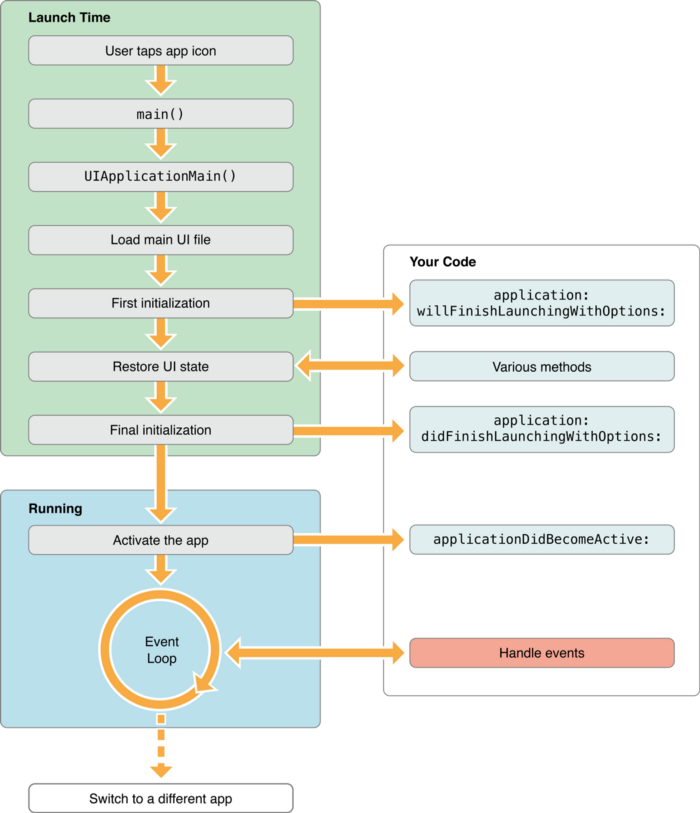

# 概念

RunLoop有时候也被称为EventLoop，它是所有GUI系统，甚至一切计算系统的任务执行机制。

对于任何计算系统，都需要一种合理的机制来处理各种任务（事件、消息），比如延迟任务的执行，定时任务的调度等。而这对于GUI系统来说更为重要，因为还会涉及**对交互性要求更高的用户输入事件**，这就要求系统在某些情况下优先处理用户输入事件。这样一来，系统的执行机制就变得更加复杂。

不过，抽象之后的RunLoop模型其实非常简单，总共两个步骤：
1. 将所有新任务加入一个队列；
2. 如果队列中有任务，按照某种顺序取出一个任务，执行。不断执行，直到任务队列为空。

用伪代码表示如下。

```objc
while (appHasTasks) {
    id task = [queue getNextTask];
    [self processTask: task];
} 

// 在适当时机加入任务
[queue addTask: someTask];
// ...
```

对于iOS来说，系统运行流程如下：



其中，涉及RunLoop的系统级服务：GCD、Block、Thread等，应用级服务包括：NSObject(NSDelayedPerforming)、NSObject(NSThreadPerformAddtion)、NSTimer、CADisplayLink、CATransition、NSPort、NSURLConnection等。

# 原理
## Run Loop Mode

根据[Apple官方文档](https://developer.apple.com/library/archive/documentation/Cocoa/Conceptual/Multithreading/RunLoopManagement/RunLoopManagement.html#//apple_ref/doc/uid/10000057i-CH16-SW3)，RunLoop Modes是由**输入源Input Source、定时间Timer和观察者Observer**组成的一个集合。每次启动一个RunLoop，都要指定一种Mode，而在此Mode下，只有与其相关的事件（Input Source，Timer，Observer）才能被调度。如果要切换RunLoop的Mode，那么需要先停止当前RunLoop，再以新Mode启动。

预定的Run Loop Modes：

- `NSDefaultRunLoopMode`：默认模式，大多数情况下适用；
- `UITrackingRunLoopMode`：滑动ScrollView时使用；
- `UIInitializationRunLoopMode`：启动时首次使用的Mode；
- `NSRunLoopCommonModes`：包含多种Mode的集合，包括Default、UITrack等模式。

更多的Modes见：[iphonedevwiki](http://iphonedevwiki.net/index.php/CFRunLoop)

有一个奇怪的现象：当滑动ScrollView时，NSTimer将不再执行。这就是因为Timer是在`NSDefaultRunLoopMode`下执行的，而滑动ScrollView时会切换到`UITrackingRunLoopMode`，而解决这一问题的方法就是通过将Timer添加到NSRunLoopCommonModes。

```objc
// NSTimer默认加入到NSDefaultRunLoopMode
NSTimer *timer = [NSTimer scheduledTimerWithTimeInterval:.2 repeats:YES block:^(NSTimer * _Nonnull timer) {
    NSLog(@"default mode");
}];
[NSRunLoop.currentRunLoop addTimer:timer forMode:NSDefaultRunLoopMode];
    [NSRunLoop.currentRunLoop runUntilDate:[NSDate dateWithTimeIntervalSinceNow:10]];

// 加入Common mode
NSTimer *timer = [NSTimer timerWithTimeInterval:.2 repeats:YES block:^(NSTimer * _Nonnull timer) {
    NSLog(@"common modes");
}];
[NSRunLoop.currentRunLoop addTimer:timer forMode:NSRunLoopCommonModes];
[NSRunLoop.currentRunLoop runUntilDate:[NSDate dateWithTimeIntervalSinceNow:10]];
```

## 任务类型
这里的任务泛指一切可以被RunLoop调度执行的计算过程，也可以称为事件或消息。

### Input Source
为线程发送异步任务的一切来源都可称之为Input Source，有三个类型：基于端口的，自定义的，Selector相关的。

- 基于端口：主要来自系统的内置服务，比如网络、Socket编程相关；
- 自定义：需要配置回调函数和任务分发机制，很少使用；
- Selector相关：会被序列化在对应线程上，执行完成之后会被移除。

关于Selector Source，主要包括：
- Main Thread
    - `performSelectorOnMainThread:withObject:waitUntilDone:`
    - `performSelectorOnMainThread:withObject:waitUntilDone:modes:`
- Other Thread
    - `performSelector:onThread:withObject:waitUntilDone:`
    - `performSelector:onThread:withObject:waitUntilDone:modes:`
- Delay
    - `performSelector:withObject:afterDelay:`
    - `performSelector:withObject:afterDelay:inModes:`
- Cancel
    - `cancelPreviousPerformRequestsWithTarget:`
    - `cancelPreviousPerformRequestsWithTarget:selector:object:`

### Timer Source
指Apple已经封装好的定时器`NSTimer`和`CADisplayLink`。当其加入到 RunLoop 时，RunLoop将注册任务到对应的时间点，当时间点一到，RunLoop会被唤醒以执行对应任务。

- NSTimer
    - `scheduledTimerWithTimeInterval: repeats: block:`
    - `scheduledTimerWithTimeInterval: invocation: repeats:`
    - `timerWithTimeInterval: repeats: block:`
    - `timerWithTimeInterval: target: selector: userInfo: repeats:`
- CADisplayLink
    - `displayLinkWithTarget: selector:`
    - `addToRunLoop: forMode:`
    - `removeFromRunLoop: forMode:`

```objc
- (void)addDislayLinkForDefaultMode{
    CADisplayLink *dl = [CADisplayLink displayLinkWithTarget:self selector:@selector(doDispaly)];
    dl.preferredFramesPerSecond = 10;
    [dl addToRunLoop:NSRunLoop.currentRunLoop forMode:NSDefaultRunLoopMode];
    [NSRunLoop.currentRunLoop runUntilDate:[NSDate dateWithTimeIntervalSinceNow:10]];
}

- (void)doDispaly{
    NSLog(@"display...");
}
```

### Observer
Observer是任务的观察者，就和应用程序的生命周期一样，会在RunLoop内在状态发生变化时会执行特定的任务。比如在RunLoop开始执行Timer时，在开始处理Input Source时，在RunLoop进入休眠状态时所要执行的回调。

可观察的状态包含：
```objc
typedef CF_OPTIONS(CFOptionFlags, CFRunLoopActivity) {
    kCFRunLoopEntry         = (1UL << 0), // 即将进入RunLoop
    kCFRunLoopBeforeTimers  = (1UL << 1), // 即将处理 Timer
    kCFRunLoopBeforeSources = (1UL << 2), // 即将处理 Source
    kCFRunLoopBeforeWaiting = (1UL << 5), // 即将进入休眠
    kCFRunLoopAfterWaiting  = (1UL << 6), // 刚从休眠中唤醒
    kCFRunLoopExit          = (1UL << 7), // 即将退出RunLoop
    kCFRunLoopAllActivities = 0x0FFFFFFFU // 包含以上所有状态
};
```

```objc
/**
 注意这里的顺序：
    1. 先开始观察；
    2. 然后加入对应Source，比如Timer、Selector；
    3. 最后开始运行RunLoop。
 */
- (void)addObserverFor:(NSRunLoop *)runloop mode:(CFRunLoopMode)mode callback:(CFRunLoopObserverCallBack)callback{
    NSRunLoop *runLoop = [NSRunLoop currentRunLoop];
    CFRunLoopObserverContext context = {0, (__bridge void *)(self), NULL, NULL, NULL};
    CFRunLoopObserverRef observer = CFRunLoopObserverCreate(kCFAllocatorDefault, kCFRunLoopAllActivities, YES, 0, callback, &context);
    
    if (observer) {
        CFRunLoopRef rl = [runLoop getCFRunLoop];
        CFRunLoopAddObserver(rl, observer, mode);
    }
}

// 观察Timer Source
- (void)addTimerForDefaultMode{
    // NSTimer默认加入到NSDefaultRunLoopMode
    [self addObserverFor:[NSRunLoop currentRunLoop] mode:kCFRunLoopDefaultMode callback:timerDefaultModeCallback];
    
    NSTimer *timer = [NSTimer scheduledTimerWithTimeInterval:.2 repeats:YES block:^(NSTimer * _Nonnull timer) {
        NSLog(@"default mode, time elapse 0.2 second");
    }];
    [NSRunLoop.currentRunLoop addTimer:timer forMode:NSDefaultRunLoopMode];
    [NSRunLoop.currentRunLoop runUntilDate:[NSDate dateWithTimeIntervalSinceNow:5]];
}
```

# 实践
## UITableView加载图片
当滑动UITableView、UICollectionView时，如果同时还在异步加载图片，通常会出现卡顿现象。这是因为加载图片默认是在`NSDefaultRunLoopMode`/`kCFRunLoopDefaultMode`模式下运行，而在滑动时会切换到`UITrackingRunLoopMode`，这时候放到`NSRunLoopCommonModes`下就会解决。

```objc
UIImage *image = [[UIImage alloc]initWithData:data];
[self performSelectorOnMainThread:@selector(updateUI:)
                       withObject:obj
                    waitUntilDone:YES
                            modes:@[NSRunLoopCommonModes]];
```

## 多线程
在多线程中，如果每次执行完之后都会有回调要在主线程下执行，为了防止死锁，用下面代码避免。

```objc
void runOnMainQueueWithoutDeadlocking(void (^block)(void)) {
    if ([NSThread isMainThread]) {
        block();
    } else {
        dispatch_sync(dispatch_get_main_queue(), block);
    }
}
```

来自Stack Overflow。

# 参考
- [Apple官方文档](https://developer.apple.com/library/archive/documentation/Cocoa/Conceptual/Multithreading/RunLoopManagement/RunLoopManagement.html#//apple_ref/doc/uid/10000057i-CH16-SW3)
- [Apple开源代码](https://opensource.apple.com/source/CF/CF-855.17/CFRunLoop.c.auto.html)
- [Garan no Dou博文](https://blog.ibireme.com/2015/05/18/runloop/)
- [戴铭博文](https://github.com/ming1016/study/wiki/CFRunLoop)