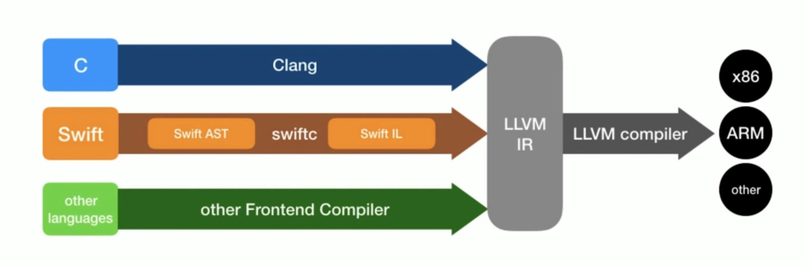

# Swift

### 版本演化

- 项目启动：2010.7
- v1.0: 2014.8
- v2.0: 2015.9
  - error handle增强
  - `guard`语法
  - 协议支持扩展
- v3.0: 2016.9
  - 新GCD和Core Graphics
  - 移除NS前缀
  - 内联序列函数sequence
  - `fileprivate`，`open`关键字
  - 移除弃用运算，比如++、--。为什么要移除？
    - ++不比+=1简洁多少
    - 不希望和其他语言混淆
    - 在别的语言中主要用在`for`循环中，swift中的`for`循环用法不一样
- v4.0: 2017.9
  - `extension`中可以访问`private`属性
  - 类型和协议的组合类型
  - Associated Type可以追加Where约束语句
  - 新的Key Path语法
  - 下标支持泛型
  - 字符串增强
- v5.0: 2019.3
  - ABI稳定
  - Raw strings
  - 标准库新增Results
  - 和Python、Ruby互操作的动态可调用类型

### 与Objective-C的区别

| 比较项   | Swift                                                        | Objective-C                                               |
| -------- | ------------------------------------------------------------ | --------------------------------------------------------- |
| 编程范式 | 面向协议编程<br />面向对象编程<br />函数式编程               | 主要以面向对象为主<br />可引入ReactiveCocoa实现函数式编程 |
| 类型安全 | 严格的类型检查                                               | 动态特性变量类型不定，比如`id`类型                        |
| 值类型   | struct、enum、tuple<br />Int、Float、String、Set等都是值类型 | NSNumber、NSString是指针类型                              |
| 枚举     | 支持更多类型，协议、扩展，属性方法等                         | 只是一个标记                                              |
| 泛型     | 支持，并且支持类型约束特性                                   | /                                                         |
| 协议     | 支持很丰富，配合扩展、泛型、关联类型可实现面向协议编程<br />还可以用到值类型中，比如struct、enum等 | 缺乏强约束，optional是很多问题的来源                      |
| 函数     | 一等公民，可作为变量传递给函数、属性等                       | 此等公民，要借助selector和block封装才能实现对应功能       |

### 编译

##### 流程



从Swift代码到机器代码，重要要经过这些步骤：

- Swift AST抽象语法树，用Swift的Parse模块
- Swift IR，通过swiftc命令行工具得到中间表示，用Sema和SILGen模块
- LLVM IR，用Analysis和IRGen模块生成
- executable code，通过LLVM编译器转换成真正的机器代码

##### 语法

- 可执行文件：`swiftc -o main.out main.swift`
- 抽象语法树：`swiftc main.swift -dump-ast`
- Swift中间表示语言： `swiftc main.swift -emit-sil`
- LLVM中间表示语言； `swiftc main.swift -emit-ir`
- 汇编语言： `swiftc main.swift -emit-assembly`

更多的语法见：[swiftc helps](https://gist.github.com/enomoto/7f11d57e4add7e702f9f84f34d3a0f8c)

# 基本数据类型

### 变量 vs 常量

变量常量都可以使用Unicode，但不能使用空白符、数学符号、箭头以及保留的。用`let`声明常量，用`var`声明变量。

```swift
let a = 1	// can't change after declare
var b = 2
b = 3
```

### 数值类型

##### 整数

在Swift中，可以明确指定整数的位长，比如8位、16位、32位、64位。当然，也可以不指定位数，直接使用Int、UInt，表示和当前平台的原生字相同的长度，比如在32位机器上就表示32位。

**建议在用到整数的地方统一使用Int或者UInt**。

```swift
print("Int  : [\(Int.min) \(Int.max)]")			// "Int  : [-9223372036854775808 9223372036854775807]\n"
print("UInt : [\(UInt.min) \(UInt.max)]")		// "UInt : [0 18446744073709551615]\n"
print("Int32: [\(Int32.min) \(Int32.max)]")	// "Int32: [-2147483648 2147483647]\n"
```

##### 浮点数

- Float，32位浮点数，至少有6位数字的精度
- Double，64位浮点数，至少有15位数字的精度
- **在两种类型都可以用时，建议使用Double类型**

##### 布尔值

`true`和`false`，在`if`中，必须使用布尔值，不能使用其他类型。**Swift不会做隐式转换，将其他类型转换为布尔类**。

##### 类型别名

可以用用`typealias`为某个已经存在的类型定义一个别名，可以更加准确地表达业务逻辑。

```swift
typealias Duration = Float
let duration: Duration = 10.89
```

##### Tuple元组

概念来源于Python，表示将多个单一类型的元素组合成复合值，里面可以是任何类型，而不像Array要求类型一致。注意📢：**元组一旦创建好，就不能修改，比如添加和删除元组**。

###### 元组命名

- 每个元素都可以指定对应的名称
- 如果没有指定名称，也可以使用下标的方式引用

###### 修改

- 用var声明的是可变元组，用let声明的是不可变元组
- 可以对可变元组修改元素值，但不能修改元素类型
- **any类型可以改为任何类型**

###### 分解

- 可以将元组分解为单个变量或常量
- 如果不需要其中的一部分，可以用下划线 `_` 表示

```swift
let error = (1, "No permission")
print(error)
print(error.0)

var anotherError = (errorCode:1, errorMessge: "No Permission")
print(anotherError.errorCode)
anotherError.errorCode = 2

var anyTypeError:(errorCode: Int, errorMessage: Any) = (errorCode: 1, errorMessage: "No Permission")
anyTypeError.errorMessage = false
```

##### Optional可选项

###### 必要性

在很多语言中都没有这种类型，那为什么需要可选值这种独特的类型呢？主要是为了**建立完备、清晰的类型系统**。在Objective-C中，用`nil`表示空指针，但这种方式存在诸多不便，比如：

- `nil` 没有类型信息
- 集合类型中不能有 `nil`
- 所有对象类变量都可以为 `nil`
- 只能用在对象类型上，其他地方需要用其他值，比如 `NULL`

###### 使用

在Swift中，通过在变量类型后面添加一个 `?` ，可将其变成可选项，**它表示可能存在某个值x，也可能根本不存在**。可以将 `nil` 赋值给可选值项，表示空值。但是，Objective-C中的 `nil` 和Swift中的 `nil` 之间存在很大的差异。

- 在Objective-C中，**nil表示指向一个不存在对象的指针**
- 在Swift中，**nil不是指针**，它只是值缺失的一种特殊类型

在Swift中，可选值项不能直接使用，只能通过 `!` 展开之后才能使用。使用Optional的两种方式：

- 先在 `if` 中判断是否为 `nil`，如果不是用 `!` 展开即可获得原始值
- **可选绑定**。在 `if` 或者 `while` 语句中，赋值给一个临时变量，而且用“，”对多个Optional做可选绑定
- **隐式展开**。定义可选值的时候不用 `?` 而用 `!` ，使用时便可自动展开。这种方式比较危险。

###### 可选链

**如果可选项在多个变量之间传递**，就构成一条可选链。在赋值的时候，还要在可选项后面加上 `?` ，新变量依然是一个可选值变量。

```swift
let name: String? = "Walker"
print(name.count)		// errors

if name != nil {
    print(name!.count)
}
if let unwrappedName = name {
    print("\(unwrappedName) characters count: \(unwrappedName.count)")
}

let hiddenOptional: String! = "Hello"
print(hiddenOptional.count)

// 可选链
let nameCount = name?.count
let index = nameCount - 1   // error, it is an optinal value
if let count = nameCount {
    print(count)
}
```

###### 原理

Optional实际上是Swift标准库中的一个枚举enum类型，用 `none` 表示 `nil` ，用 `some` 表示某个值，通过 `unsafelyUnwrapped` 解包具体的值，得到 `nil` 或者某个真实值。

```swift
@frozen public enum Optional<Wrapped> : ExpressibleByNilLiteral {

    /// The absence of a value.
    ///
    /// In code, the absence of a value is typically written using the `nil`
    /// literal rather than the explicit `.none` enumeration case.
    case none

    /// The presence of a value, stored as `Wrapped`.
    case some(Wrapped)
  ...
}
```

##### 字符串

###### 创建

字符串的创建方式比较多，形式也比较多。是值类型。

- 单行字符串
  - 字面量
  - `String()` 语法
- 多行字符串
  - 三个 `"` 括起来的字符串
- 扩展字符串分隔符Raw String
  - 把字符串放在双 `"` 内，并用 `#` 包裹
  - 如果字符串中有 `#`，则首尾需要两个 `#`
  - 转义字符需要在 `\` 和 `char` 之间放置同样数量的 "#"

###### 操作

- 遍历
  - 得到Character
  - Character类型的数组通过`String()`可初始化字符串
- 拼接
  - `+=`
  - `append()`，追加
- 插值
  - `\(someVar)  and strings...`
  - `String(format: **<#T##String#>**, **<#T##arguments: CVarArg...##CVarArg#>**)`

```swift
var weekday = "Tuesday"
var index = weekday.index(after: weekday.startIndex)
weekday.suffix(3)
weekday.prefix(3)
weekday.append(contentsOf: " is open")
weekday.insert(contentsOf: " there", at: weekday.endIndex)
weekday.removeSubrange(weekday.index(weekday.startIndex, offsetBy: 5)..<weekday.endIndex)
```

# 运算符

### 基本操作

###### 排查错误

Swift在支持C中大部分运算符的同时，还增加了**排查错误的能力**

- 赋值运算符 `=` 不会返回值，以防止被用在等于符号 `==` 上
- 算数符号(+ - * / %)可以检测值溢出，避免某些奇怪的结果

###### 常见运算

- 余数运算符 `a % b`
  - a为负数时也可以进行计算
  - b为负数时和b为正数的结果一样，`a % b` == `a % -b`
- 溢出运算符，**用常规运算符计算的值超过变量能容纳的范围时会报错，但是溢出运算符不会**
  - 溢出加法 `&+`
  - 溢出减法 `&-`
  - 溢出乘法 `&*`
- 合并空值运算符 `a ?? b`
  - 如果可选值a有值，则展开，否则返回默认值b
  - **a必须为可选项，b和a的类型相同**
  - 实际上是三元运算符 `a != nil ? a! : b` 的缩写
- 区间运算符
  - 闭区间运算符
    - `a...b` 定义了从a到b之间的一组范围
    - **a和b包含在内，且a<=b**
  - 开区间运算符
    - `a..<b`定义了从a到b之间的一组范围，不包含b
    - a<=b，当a==b时返回空
  - 单侧区间运算符
    - 闭区间对应的单侧区间`...2`或者`2...`
    - 开区间对应的单侧区间`..<2`
  - Comparable区间
- 位运算符
  - 取反运算符 `~` !0 = 1; !1=0
  - 位与运算符 `&` 1&1=1; 0&0 = 0&1 = 1&0 = 0  >>  `0&x = 0`
  - 位或运算符 `| ` 0|0 = 0; 0|1 = 1|0 = 1|1 = 1   >>  `1|x = 1`
  - 位异或运算符 `^` 1^1 = 0 ^ 0 = 0; 1^0=0^1 = 1>> ` 0^x = x`
  - 左移、右移运算符 `<<`、`>>`

```swift
let a = 5
let b = 2
let e = a % -b										// e = 1

// 溢出运算符
var uintmax: UInt8 = 255
uintmax += 10											// error
let uint8max: UInt8 = 255
var uint: UInt8 = uint8max &+ 10	// 9
let uint8min: UInt8 = 1
uint = uint8min &- 10							// 247

// 闭区间
let ab = 1...5
let ba = 5...1										// error
for i in ab {
    print(i)
}																	// 1 2 3 4 5
// 开区间
let months: [Int] = [31, 28, 31, 30]
for m in 0..<months.count {
    print("month \(m+1) has \(months[m]) days")
}
// 单侧区间
let range = ...5
range.contains(2)									// true
range.upperBound									// 5
range.self												// PartialRangeThrough<Int>
for n in months[1...] {
    print(n)
}
for n in months[...2] {
    print(n)
}
```

### 经典算法

用位运算可以高效地实现很多算法，比如不借助临时变量交换两个数字，无符号数中的个数等。

##### 交换两个数字

```swift
func swapByBit(a: inout Int, b: inout Int) {
    a = a ^ b
    b = a ^ b
    a = a ^ b
}

func swapByAdd(a: inout Int, b: inout Int) {
    a = a + b
    b = a - b
    a = a - b
}
```

##### 二进制无符号数中1的个数

将每一位和1做与操作，如果此位是1，那么结果也是1，不断右移直到数字变成0.

```swift
func computeBitOnes(n: Int) -> Int {
    var tmp = n
    var count = 0
    while tmp > 0 {
        count += tmp & 1
        tmp = tmp >> 1
    }
    return count
}
```

### 运算符方法

##### 运算符重载

**类和结构体可以为现有的运算符提供自定义实现，称之为运算符重载**。对于一元运算符，需要在`func`关键字之前通过`prefix`和`postfix`分别说明是前缀还是后缀。

对于组合运算符，还要在要值会改变的变量之前，加上`inout`关键字。

```swift
struct Point {
    var x: Double = 0.0
    var y: Double = 0.0
}
extension Point {
    static func + (left: Point, right: Point) -> Point {
        return Point(x: left.x+right.x, y: left.y+right.y)
    }
  	static prefix func - (p: Point) -> Point {
        return Point(x: -p.x, y: -p.y)
    }
}
extension Point: CustomStringConvertible {
    var description: String {
        get {
            return "(\(x), \(y))"
        }
    }
}
let p1 = Point(x: 1.2, y: 3.2)			// (1.2, 3.2)
let p2 = Point(x: 2.1, y: 2.3)			// (2.1, 2.3)	
let p3 = p1 + p2										// (3.3, 5.5)
let p4 = -p3												// (-3.3, -5.5)
```

##### 组合赋值运算符

**组合赋值运算符将赋值运算符 `=` 与其它运算符进行结合**。在实现的时候，需要把运算符的左参数设置成 `inout` 类型，因为这个参数的值会在运算符函数内被修改。

```swift
extension Point {
    static func += (left: inout Point, right: Point) {
        left = left + right
    }
    static func -= (left: inout Point, right: Point) {
        left = left + (-right)
    }
}
```

##### 等价运算符

自定义类和结构体不提供等价运算符（等于运算符 `==` 和不等于运算符 ` !=`）的默认实现。要使用等价运算符来检查自定义类型的等价性，需要和其他中缀运算符一样重载等于运算符 `==`，并遵循标准库的 Equatable 协议

```swift
extension Point: Equatable {
    static func == (left: Point, right: Point) -> Bool {
        return left.x == right.x && left.y == right.y
    }
}
```

其实，Swift为遵循Equatable协议的类型提供了等价运算符的合成实现。

- 只拥有遵循 Equatable 协议存储属性的结构体
- 只拥有遵循 Equatable 协议关联类型的枚举
- 没有关联类型的枚举

##### 自定义运算符

除了实现标准运算符，在 Swift 当中还可以声明和实现自定义运算符（custom operators）。新的运算符要在全局作用域内，使用`operator` 关键字进行声明，同时还要指定 `prefix` 、`infix` 或者 `postfix` 限定符。

```swift
prefix operator ++
extension Point {
    static prefix func ++ (p: inout Point) {
        p += p
    }
}
++p4		// (-6.6, -11.0)
```

如果要自定义中缀运算符，为了将所有运算规则统一处理，还需要指明它的优先级和结合性，可以通过自定义优先级组来实现。

```swift
precedencegroup PointAddMinusPrecedence {
    associativity: left
    lowerThan: AdditionPrecedence
}
precedencegroup PointMultiplyMinusPrecedence {
    associativity: left
    higherThan: PointAddMinusPrecedence
    lowerThan: AdditionPrecedence
}

infix operator +-: PointAddMinusPrecedence
infix operator *-: PointMultiplyMinusPrecedence

extension Point {
    static func +- (left: Point, right: Point) -> Point {
        return Point(x: left.x + right.x, y: left.y - right.y)
    }
    static func *- (left: Point, right: Point) -> Point {
        return Point(x: left.x * left.y, y: left.y - right.y)
    }
}
```

# 遍历

### for

使用 `for-in` 循环来遍历序列，比如一个范围内的数字，数组中的元素或者字符串中的字符。当遍历字典时，每一个元素都返回一个 (key, value) 元组，可以在 for-in 循环体中使用显式命名常量来分解 (key, value) 元组成员。

如果不需要值，可以用下划线`_`忽略。

```swift
let scholarship: [Int: Int] = [1: 2000, 2: 5000, 3:800]
for (level, money) in scholarship {
    print("scholarship level \(level) worth \(money)")
}
for s in scholarship {
    print("scholarship level \(s.0) worth \(s.1)")
}
```

**如果只遍历一部分，可以通过分段区间来实现**。

- 使用 `stride(from:to:by:)` 函数来跳过不想要的标记 (开区间)
- 闭区间也同样适用，使用 `stride(from:through:by:)` 即可

从字面意思理解，两者之间的区别在于前者是开区间，后者是闭区间。

```swift
for i in stride(from: 0, to: 10, by: 2) {
    print(i)
}
// 0 2 4 6 8
for i in stride(from: 0, through: 10, by: 2) {
    print(i)
}
// 0 2 4 6 8 10
```

### while

Swift中，`do...while`需要用`repeat...while`替代。

```swift
var count = 5
repeat {
    print(count)
    count -= 1
} while count > 0
```

### switch

Swift中的 `switch` 语句非常强大，不但能够实现其他语言中类似的功能，还能实现很多全新功能。

**switch语句一定是全面的**，也就是说，对于每一个变量类型，都要为每一种 `case` 提供处理逻辑，否则用一个 `default` 分支处理。尤其在对 `enum` 类型做 `switch` 遍历时，默认会提供所有 `case`，而且每一个 `case`中需要至少提供一行可执行代码。

```swift
switch state {
    case .failure:
    	print("you are failure")
    case .next:
    	print("and next")
    case .success:
    	print("congratuations, you are an winner!")
}
```

另外一点需要注意📢的是，相比 C 和 Objective-C 里的 `switch` ，**Swift 里的 `switch` 语句默认不会从匹配 case 的末尾贯穿到下一个 case 里**。

##### 区间匹配

对于数值类型变量（整数、浮点数），可以通过某个多个case匹配是否在对应区间。这会让代码的可读性增强，因为在不提供这种机制时，必须使用 `if` 不断地做多种复杂判断。

```swift
let someNumber: Float = 13.0
// let someNumber: Int = 13
switch someNumber {
case 0...3:
    print("some number is in [0, 3]")
case 4...10:
    print("some number is in [4, 10]")
case ...100:
    print("some number is in [11, 100]")
default:
    print("some number greater than 100")
}
// some number is in [11, 100]
```

##### 元组匹配

可以使用元组在一个 `switch` 语句中测试多个值，如果不用某个元素，可以用 `_` 忽略。

`switch` 的 `case` 可以将匹配到的值临时绑定为一个常量或者变量，来给 `case` 的函数体使用。如果使用 `var` 关键字，临时的变量就会以合适的值来创建并初始化。对这个变量的任何改变都只会在 `case` 的函数体内有效。

而且，`switch case` 可以使用 `where` 分句来检查是否符合特定的约束。

```swift
private func convertToPosition(at index: Int) -> MinePosition {
    let xy = (index / config.cols, index % config.cols)
    var position: MinePosition
    switch xy {
    case (0, 0):
        position = .topLeftCorner
    case (0, config.cols-1):
        position = .topRightCorner
    case (config.rows-1, 0):
        position = .bottomLeftCorner
    case (config.rows-1, config.cols-1):
        position = .bottomRightCorner
    case (0, 1..<config.cols-1):
        position = .topEdge
    case (1..<config.rows-1, 0):
        position = .leftEdge
    case (1..<config.rows-1, config.cols-1):
        position = .rightEdge
    case (config.rows-1, 1..<config.cols-1):
        position = .bottomEdge
    default:
        position = .inside
    }
    return position
}
```

##### 复合匹配

多种情形共享同一个函数体的多个情况时，可以在 `case` 后写多个模式，在每个模式之间用逗号分隔。如果任何一个模式匹配了，那么这个情况都会被认为是匹配的。如果模式太长，也可以把它们写成多行。

复合匹配同样可以包含值绑定。所有复合匹配的模式都必须包含相同的值绑定集合，并且复合情况中的每一个绑定都要有相同的类型格式。这才能确保无论复合匹配的那部分命中了，接下来的函数体中的代码都能访问到绑定的值并且值的类型也都相同。

# 