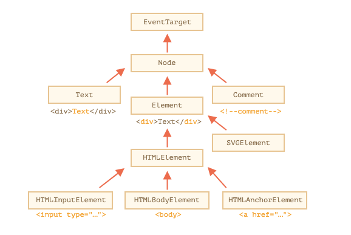
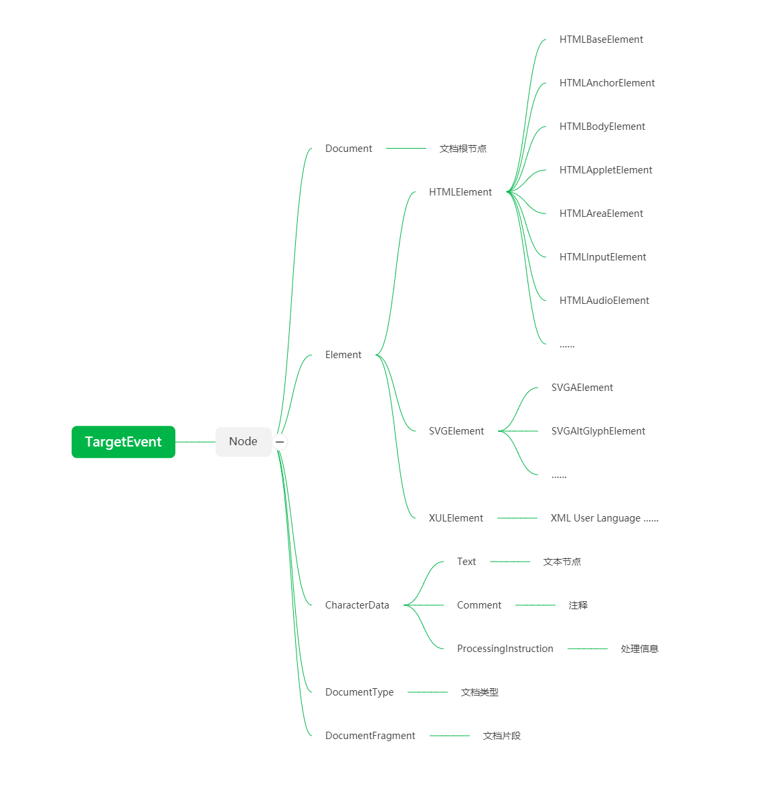
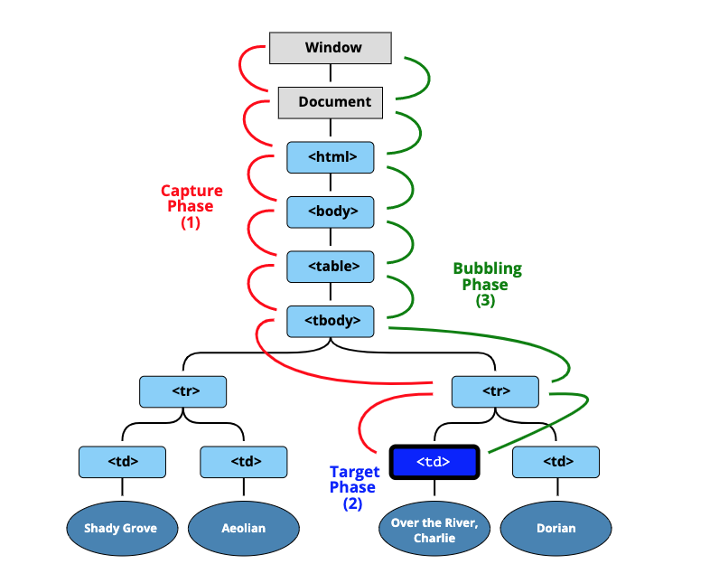

# 简介
## What
虽然网页内容使用各种标签平铺而成的，但是在浏览器中它们却不是同样的平铺结构，而是被解析为树形结构，所有的标签按照层级关系建模构建成一棵树，这棵树就被称为“文档对象模型”树，英文为Document Of Object，简称DOM树。

## Why
为什么要这么做？一方面是因为“面向对象”编程的强大，几乎所有在操作系统之上构建的大型软件都离不开这一思想和工具，另一方面是因为树形结构是对一切复杂层级系统的抽象，一本书的结构、一个家族的人员关系、一个公司的上下级关系、甚至一个国家的治理模式，实际上都是一种树形结构。

所以，基于这些思想和工具来构建复杂文档的结构也就可以理解了。

## DOM API分类

DOM API就是DOM树开放给开发者的接口，是对系统能力的延伸，大致会包含4个部分。

- 节点：DOM树形结构中的节点相关API；
- 事件：触发和监听事件相关API；
- Range：操作文字范围相关API；
- 遍历：遍历DOM需要的API。 

# 节点

主要的DOM树节点的继承关系如下：



使用代码验证：
```js

    alert(document.body.constructor.name) // "HTMLBodyElement"
    alert(document.body) // [object HTMLBodyElement]

    document.body instanceof HTMLBodyElement // true
    document.body instanceof HTMLElement // true
    document.body instanceof Element // true
    document.body instanceof Node // true
    document.body instanceof EventTarget //true
    
    HTMLInputElement.prototype.__proto__ === HTMLElement.prototype //true
    HTMLAnchorElement.prototype.__proto__ === HTMLElement.prototype // true

```

完整的继承关系如下所示：



## Node

Node是DOM树继承关系的根节点，相当于一个“抽象类”，提供了操作DOM的基础能力，主要有下面这些API：

- 关系节点
    - `parentNode`，父节点；
    - `childNodes`，孩子节点；
    - `firstChild`，第一个孩子节点；
    - `lastChild`，最后一个孩子节点；
    - `nextSibling`，下一个兄弟节点；
    - `previousSibling`，上一个兄弟节点。
- 操作节点
    - `appendChild`，在后面添加孩子节点；
    - `insertBefore`，在某个节点之前添加；
    - `removeChild`，删除某个节点；
    - `replaceChild`，替换某个节点
    - `cloneNode`，复制一个节点，如果传入参数true，则会连同子元素做深拷贝。
- 比较关系
    - `compareDocumentPosition`，是一个用于比较两个节点中关系；
    - `contains`，检查一个节点是否包含另一个节点；
    - `isEqualNode`，检查两个节点是否完全相同；
    - `isSameNode`，检查两个节点是否是同一个节点，实际上在JavaScript中可以用“===”；
- 新建节点（DOM标准规定文档节点必须由`create`方法创建，而不能用JavaScript的`new`创建）
    - `createElement`
    - `createTextNode`
    - `createCDATASection`
    - `createComment`
    - `createProcessingInstruction`
    - `createDocumentFragment`
    - `createDocumentType`

## Element

Node提供了在树形结构中操作节点的能力，但是很多时候我们需要的Element元素，是Node的子类，对应了HTML中的标签，即有子节点，又有属性。

### 属性
#### innerHTML
表示元素后代的HTML序列，设置新元素将会先删除老元素，再创建新元素。

如果设置一个非法HTML值，浏览器会进行修正。
```js
    document.body.innerHTML = '<b>test';
    alert( document.body.innerHTML ); 
    // <b>test</b>
```

#### outerHTML
该节点的所有HTML内容，是它自己和`innerHTML`的合集。

注意，修改`outerHTML`并不会改变该元素的值，因为这样操作不符合“面向对象”的特征：父元素拥有子元素，只有父元素才能“操作”子元素。显然，要修改`outerHTML`的值，只有`outerHTML`的父元素通过`innerHTML`来修改。

#### data
innerHTML适用于所有Element节点。但是有些节点不是Element，比如Text，Comment，这时候可以使用`data`属性获取，或者用`nodeValue`获取。
```html
    <body>
    Hello
    <!-- Comment -->
    <script>
        let text = document.body.firstChild;
        alert(text.data); // Hello

        let comment = text.nextSibling;
        alert(comment.data); // Comment
    </script>
    </body>
```

#### 关系属性
类似Node中的属性，只是变成了Element子类。
- `parentElement`，父Element节点；
- `children`，所有Element子节点；
- `firstElementChild`，第一个Element子节点；
- `lastElementChild`，最后一个Element子节点；
- `nextElementSibling`，下一个兄弟Element节点；
- `previousElementSibling`，上一个兄弟Element节点。

#### Others
- `nodeName`: 对应Node，所有继承自Node的子类都有;
- `tagName`: 对应Element，只有继承自Element的才有；
- `textContent`: 获取所有后代元素的Text值；
- `hidden`: 是否显示，和`style="display:none"`左右相同;
- `value`: 对应`<input>,` `<select>` and `<textarea>`的值；
- `href`: 对应链接的href值；
- ……

### 方法

#### 操作属性

- `getAttribute`
- `setAttribute`
- `removeAttribute`
- `hasAttribute`
- `getAttributeNode`
- `setAttributeNode`

此外，还可以像访问property一样，访问attribute，比如`document.body.attributes.class = “a”` 等效于 `document.body.setAttribute(“class”, “a”)`。

#### 查找元素

- `querySelector`
- `querySelectorAll`
- `getElementById`
- `getElementsByName`
- `getElementsByTagName`
- `getElementsByClassName`

需要注意，`getElementById`、`getElementsByName`、`getElementsByTagName`、`getElementsByClassName`，这几个API的性能高于`querySelector`。

另外，由`getElementsByName`、`getElementsByTagName`、`getElementsByClassName`获取的并非一个静态数组，而是一个可动态更新的集合。

# 遍历

DOM API中还提供了NodeIterator 和 TreeWalker 来遍历树。

## NodeIterator

document.createNodeIterator(root, whatToShow); 实际上，由于性能等问题，工作中很少用到。

### 参数
- root: 文档根节点
- whatToShow: 可被访问节点
    - NodeFilter.SHOW_ALL：所有节点
    - NodeFilter.SHOW_ELEMENT：元素节点
    - NodeFilter.SHOW_TEXT：文本节点
    - NodeFilter.SHOW_COMMENT：注释节点
    - NodeFilter.SHOW_DOCUMENT：文档节点
- filter: 过滤器，根据需求返回下面这些：
    - NodeFilter.FILTER_ACCEPT
    - NodeFilter.FILTER_REJECT: 跳过当前节点和所有后代节点
    - NodeFilter.FILTER_SKIP: 仅仅跳过当前节点

比如，如果要访问所有链接，可以用下面的filter

```js
    var filter = function(node) {
        return node.tagName === 'ARTICLE' ? NodeFilter.FILTER_REJECT : 
                node.tagName === 'A' ? NodeFilter.FILTER_ACCEPT : NodeFilter.FILTER_SKIP
    }
```

基本用法：
```js
    var iterator = document.createNodeIterator(document.body, NodeFilter.SHOW_ALL, filter, false);
    var node;
    while(node = iterator.nextNode())
    {
        console.log(node);
    }
```

## TreeWalker

document.createTreeWalker(root, whatToShow);

参数、用法与`document.createNodeIterator`类似。但是，TreeWalker多了在DOM树上自由移动当前节点的能力，一般来说，这种API用于“跳过”某些节点，或者重复遍历某些节点。

```js
    var walker = document.createTreeWalker(document.body, NodeFilter.SHOW_ELEMENT, null, false)
    var node;
    while(node = walker.nextNode()) {
        if(node.tagName === "p")
            node.nextSibling();
        console.log(node);
    }
```

## 遍历DOM树
### 深度优先遍历
```js

    function deepWalk(el, action) {
        if (el) {
            action(el.nodeName)
            deepWalk(el.firstElementChild, action)
            deepWalk(el.nextElementSibling, action)
        }
    }

    deepWalk(document.documentElement, console.log)

```

### 广度优先遍历
```js

    var nodes = [document.documentElement]

    function breadthWalk(action) {
        if (nodes.length > 0) {
            let el = nodes.shift(0)
            action(el.nodeName)
            
            nodes = [...nodes, ...el.children]

            breadthWalk(action)
        }
    }

    breadthWalk(console.log)

```

# Range
Range API主要用在富文本编辑领域，平时使用较少。它表示一个范围，以文字为最小单位，不过也可以通过`offset`获取部分文字。Range 
API的性能更好，但是用起来比较麻烦。

比如，对于这段HTML：
```html
<p id="p">Example: <i>italic</i> and <b>bold</b></p>
```

它的DOM结构如下：
- `P`
    - [[text]]: Example
    - `I`
        - [[text]]: italic
    - [[text]]: and
    - `B`
        - [[text]]: bold

如果要选择而前两个字，也就是 `Example: <i>italic</i>` , 用如下代码就可以选取。
```js

    let p = document.getElementById("p")
    let range = new Range()

    range.setStart(p, 0)
    range.setEnd(p, 2)

    // 显示选取，和按鼠标右键选择效果一样
    document.getSelection().addRange(range);

```

如果要选择 ` ample: <i>italic</i> and <b>bol ` , 就需要offset。

```js

    let p = document.getElementById("p")
    let range = new Range()

    range.setStart(p.firstChild, 2);
    range.setEnd(p.querySelector('b').firstChild, 3);

    document.getSelection().addRange(range)

```

更多详细指南请看[javascript.info](https://javascript.info/selection-range)。

# 事件
### 概述

一般来说，事件来自输入设备，我们平时能够接触到的输入设备有三类：
- 键盘
- 鼠标
- 触摸屏

> 触摸屏和鼠标又有一定的共性，它们被称作pointer设备，所谓pointer设备，是指它的输入最终会被抽象成屏幕上面的一个点。但是触摸屏和鼠标又有一定区别，它们的精度、反应时间和支持的点的数量都不一样。

所有现代UI系统，都来自WIMP(Window Icon Menu Pointer)系统，以Window、Icon、Menu、Pointer这四种基本互动元素为基础，构建出了一个具有完备性的人机交互系统。WIMP最初由施乐公司发明，后来被苹果和微软用在了自家产品上，最终演变为当今UI系统的样子。

关于WIMP，乔布斯和盖茨之间还有一段小故事：
> WIMP是由Alan Kay主导设计的，这位巨匠，同时也是面向对象之父和Smalltalk语言之父。
>
> 乔布斯曾经受邀参观施乐，他见到当时的WIMP界面，认为非常惊艳，不久后就领导苹果研究了新一代麦金塔系统。
>
> 后来，在某次当面对话中，乔布斯指责比尔盖茨抄袭了WIMP的设计，盖茨淡定地回答：“史蒂夫，我觉得应该用另一种方式看待这个问题。这就像我们有个叫施乐的有钱邻居，当我闯进去想偷走电视时，却发现你已经这么干了。”

## 捕获和冒泡
在HTML DOM API中，有两种事件传播机制：捕获Capture和冒泡Bubble。很多人都知道捕获是从外向内传播，而冒泡是从内向外传播。

但是，为什么是这样的？

> 实际上点击事件来自触摸屏或者鼠标，鼠标点击并没有位置信息，但是一般操作系统会根据位移的累积计算出来，跟触摸屏一样，提供一个坐标给浏览器。
>
> 那么，把这个坐标转换为具体的元素上事件的过程，就是捕获过程了。而冒泡过程，则是符合人类理解逻辑的：当你按电视机开关时，你也按到了电视机。

所以，**计算机为了响应事件，必须获取到精确的位置信息，这个过程必须从外向内、从大到小去做命中测试` hitTest `，这就是捕获。而冒泡更加符合我们人类的行为模式，做的所有事一定是先对范围最小的元素，然后才内范围更大的元素感知**。

### 捕获Capture
当多个元素形成嵌套关系，其中的元素接收到输入事件时，此事件首先会被最外层的元素获取，然后不断向内传播。如图所示(来自[quirksmode.org](https://www.quirksmode.org/js/events_order.html))：

```s
               | |
---------------| |-----------------
| element1     | |                |
|   -----------| |-----------     |
|   |element2  \ /          |     |
|   -------------------------     |
|        Event CAPTURING          |
-----------------------------------
```

根据DOM Event标准，整个传播过程有三个阶段：
1. Capturing phase: the event goes down to the element.
2. Target phase: the event reached the target element.
3. Bubbling phase: the event bubbles up from the element.



实际上，捕获模式用的比较少，除过一些特殊场景，一般都不会用到。在事件注册API` addEventListener(type, listener, useCapture) `中，第三个参数` useCapture `默认为` false `。

### 冒泡Bubble
与捕获相反，当接收到输入事件时，首先会被最里面的元素获取，然后不断向外传播。如下图所示：
```s
               / \
---------------| |-----------------
| element1     | |                |
|   -----------| |-----------     |
|   |element2  | |          |     |
|   -------------------------     |
|        Event BUBBLING           |
-----------------------------------
```

比如这段代码：
```html
    <form onclick="alert('form')">FORM
        <div onclick="alert('div')">DIV
            <p onclick="alert('p')">P</p>
        </div>
    </form>
```
执行结果
- 点击最里层的 `p`，那么会连续显示三个弹窗，分别为p、div和form；
- 点击中间的 `div`，那么会连续显示两个弹窗，分别为div和form；
- 点击最外层的 `form`，只出现一个弹窗，显示form。

如果要阻止事件向上传播，可用` event.stopPropagation() `或者` event.stopImmediatePropagation() `.
```html
    <body onclick="alert(`the bubbling doesn't reach here`)">
        <button onclick="event.stopPropagation()">Click me</button>
    </body>
```

在IE9之前，只支持冒泡，但是IE9之后和其他浏览器对两种模式都支持。

### event.target
触发事件的所有元素中，嵌套层次最深的那一个元素，通过` event.target `获取。` event.currentTarget `则是运行事件回调的元素， `event.currentTarget = this` 。

## 焦点
焦点系统控制键盘事件。当不管是操作系统还是浏览器引入多窗口UI时，必须有一种机制用来区分到底是哪个窗口正在输入input，这一机制就是焦点系统所做的事。当一个窗口获得焦点时，它才能捕获到键盘的输入事件，其他窗口自动释放焦点。否则，所有的窗口就会失控。

在桌面浏览器中，可以用` Tab `键切换到下一个可聚焦的元素，用` shift + Tab `可以切到上一个。浏览器也提供了API来操作焦点：
```js
    // 获取
    document.body.focus();
    // 释放
    document.body.blur();
```

# 总结
浏览器DOM API为我们提供了操作DOM的能力，这大大提高了浏览器的功能性，为开发人员编写可交互应用提供了更多可能性。具体而言，可分为4类：
- 节点。节点API为操作DOM树提供了基本的支持，比如增删改查节点，获取各种关系节点，以及所有节点属性等等；
- 遍历。作为树形结构系统，遍历是在所难免的，不过这些遍历API用的并不多，主要是性能和易用性欠佳；
- Range。Range为富文本领域的应用提供了很多便利，不断功能强大，而且性能出众；
- 事件。输入输出设备的引入，扩展了计算机系统的能力，而事件就是对这些能力的抽象。
