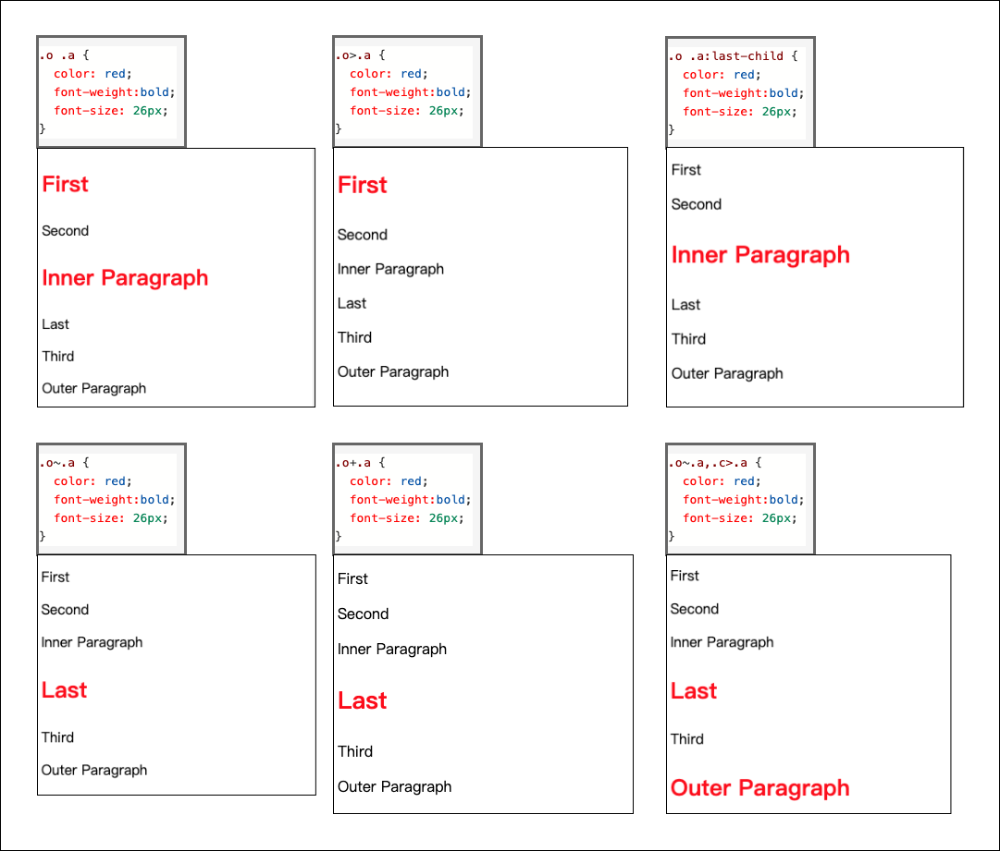
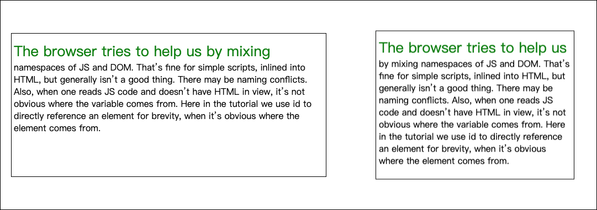
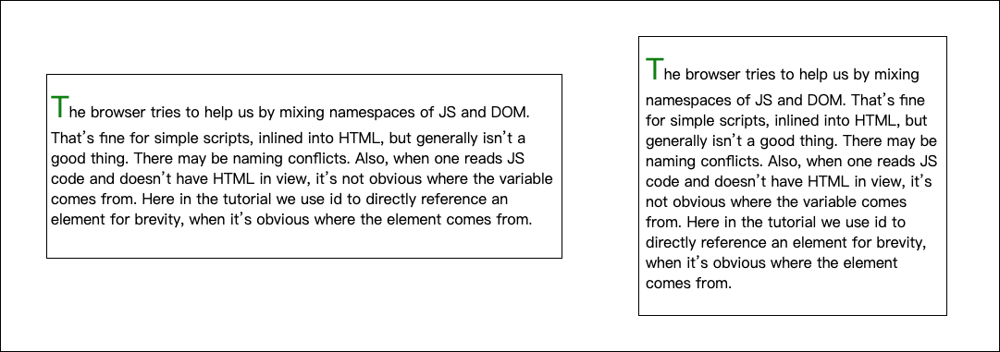

先来思考一个问题，我们为什么需要CSS选择器？

反过来想，如果没有CSS选择器，那么会出现哪些现象呢？我认为会出现下面这些：
1. 所有CSS样式都要写在Tag上，对开发效率不利；
2. 根据1，Cascading Style Sheets这个名字估计会变成Style Sheets；
3. 一旦页面完成加载和显示，则无法动态修改Tag的样式，退化至“静态页面”时代；

所以，上面三条的对立面则是我们为什么需要CSS选择器的理由。除此之外，CSS选择器还提供了更加强大的能力，比如众多伪元素的加入，会起到优化HTML的结构的作用。

按照选择器的结构做个划分，从简单到复杂可分为下面这些类：

- 简单选择器：针对单一特征判断是否选中元素。
- 复合选择器：连写在一起的简单选择器，相当于多个简单选择器的并集。
- 复杂选择器：由“（空格）”、“ `>`”、“`~`”、“`+`”、“`||`”等符号连接的复合选择器，根据元素之间的关系精确选择。
- 选择器列表：由 `,` 分隔的复杂选择器，表示“或”关系。

# 简单选择器
根据单一特征匹配元素的选择器，主要包含这些：

- 类型选择器：根据标签类型匹配，比如 `div p {}`;
- ID选择器：根据ID值匹配，比如 `#main-area {} `;
- Class选择器：根据特定属性 `class` 匹配，比如 `.user-info {} `;
- 属性选择器：根据属性名和值匹配
    - [attr]
    - [attr=val]
    - [attr~=val]
    - [attr|=val]
- 伪类选择器：根据系统添加的类匹配
    - 树形关系伪类选择器
    - 链接和行为伪类选择器
    - 用户界面伪类选择器
    - 逻辑伪类选择器
    - 其他伪类选择器

## 类型选择器
根据元素的标签名匹配，比如
```css
    div {
        font-size:40px
    }
```

这看上去非常简单，但有时候我们要考虑HTML和XML的命名空间。比如svg元素，实际上在： http://www.w3.org/2000/svg 命名空间之下。

```html
    <!DOCTYPE html>
    <html>
    <head>
        <meta charset="utf-8">
        <title>CSS Selectors</title>
    </head>
    <body>
        <svg width="100" height="28" viewBox="0 0 100 28" version="1.1"
            xmlns="http://www.w3.org/2000/svg" xmlns:xlink="http://www.w3.org/1999/xlink">
            <desc>Example link01 - a link on an ellipse
            </desc>
            <a xlink:href="http://www.w3.org">
                <text y="100%">name</text>
            </a>
        </svg>
        <br/>
        <a href="javascript:void 0;">name</a>
    </body>
    </html>
```

在上面的代码中，SVG和HTML中都有a元素，如果要区分它们，就得用带有命名空间的选择器。

```css
    @namespace svg url(http://www.w3.org/2000/svg);
    @namespace html url(http://www.w3.org/1999/xhtml);

    svg|a {
        font-size: 20px;
    }
    html|a {
        font-size:40px;
        color: red;
    }
```

另外，还有一个特殊的选择器 `*` ，称为全体选择器，可选中任意元素。

## id、class选择器

`id` 选择器和 `class` 选择器都是针对特定属性的选择器。`id` 选择器是“`#`”号后面跟随 `id` 名，`class` 选择器是“`.`”后面跟随 `class` 名。基本用法如下：

```css
    #myid {
        stroke:blue;
        stroke-width:1;
    }

    .mycls {
        font-size:40px
    }
```

对于class选择器，有时候会用空格把多个class分割开放在一起，这时候任何一个类都能选中。

```css
    <a class="a b c">xxx</a>

    .a {
        color:red;
    }
```

这种情况下，用 `.a`、`.b`、`.c` 都能选中该元素。

## 属性选择器

根据属性名和属性值的对应关系匹配元素，主要有四种形式。

### [attr]
在方括号中放入属性名，检查元素是否具有这个属性，只要元素有这个属性，不论属性是什么值，都可以被选中。

### [attr=val]
要同时满足属性名和属性值之间的对应关系。比如：
```css
    div[class=error] { 
        color:#f00; 
    }
```

### [att~=val]
多种匹配，检查一个元素的值是否是若干值之一，这里的val不是一个单一的值了，可以是用空格分隔的一个序列。
```css
td[headers~=col1] {
    color: green;
}
```

### [att|=val]
开头匹配，检查一个元素的值是否是以 `val` 或者 `val-` 开头开头。典型的应用场景是用来匹配语言简写代码（如 zh-CN，zh-TW 可以用 zh 作为 value）。


另外，还有CSS3中加入的新能力，语法类似正则表达式。
| 选择器 | 说 明 |
|----|----|
| `att^="val"` |属性att的值以"val"开头的元素|
| `att$="val"` |属性att的值以"val"结尾的元素|
| `att*="val"` |属性att的值包含"val"字符串的元素|

## 伪类选择器

伪类选择器是一系列由CSS规定好的选择器，它们以冒号`:`开头。伪类选择器有普通型和函数型两种。

### 树形关系伪类选择器

因为DOM是树形结构，对应到CSS中也会有一个属性关系，主要有下面这些伪类。

| 选择器 | 说 明 |
|----|----|
| `:root` |树的根元素，一般用html标签即可选中根元素|
| `:nth-of-type（An+b)`|符合当前标签类型的第(An+b)个元素|
| `:nth-last-child(*)` |同上，但是从后到前计数|
| `:nth-child(odd)` |符合条件的序列号为奇数的元素|
| `:nth-child(even)` |符合条件的序列号为偶数的元素|
| `:nth-child(4n-1)` |符合条件的序列号为`4n-1`的元素，比如3、7、11、···|
| `:nth-child(3n+1 of li.important)` |同上，但是还要满足一个条件`li.important`|
| `:last-of-type`|符合当前标签类型的最后一个元素|
| `:first-child` |符合条件的第一个元素|
| `:last-child` |符合条件的最后一个元素|
| `:first-of-type`|符合当前标签类型的第一个元素|
| `:empty` |没有子节点的元素|

其他请看[MDN web docs](https://developer.mozilla.org/zh-CN/docs/Web/CSS/Pseudo-classes)

### 链接与行为伪类选择器
这些伪类是最常用的一类。

| 选择器 | 说明 |
| --- | ---|
| `:any-link` |任意的链接，包括a、area和link标签都可能匹配|
| `:link` |未访问过的链接|
| `:visited` |已经访问过的链接|
| `:hover` |鼠标悬停在上的元素|
| `:active` |用户正在激活这个元素，用户按下按钮但鼠标还未抬起时|
| `:focus` |焦点落在这个元素之上时|
| `:target` |选中浏览器URL的hash部分所指示的元素|

### 逻辑伪类选择器

| 选择器 | 说明 |
| --- | ---|
| `:not` |与括号内选择器不相符的元素，只支持简单选择器|
| `:is` |在Selector Level 4草案中引入的新伪类|
| `:where` |在Selector Level 4草案中引入的新伪类|

### 用户界面相关
| 选择器 | 说明 |
| --- | ---|
| `:default` |默认表单元素|
| `:defined` |任何已定义的元素，包括标准元素和自定义元素|
| `:enabled` |表单中激活的元素|
| `:disabled` |表单中禁用的元素|
| `:checked` |表单中被选中的radio（单选框）或checkbox（复选框）元素|

# 复合选择器

在实际工作中，除过使用简单选择器之外，还会大量使用由数个简单选择器组合而成的选择器，就给它起个名字叫“复合选择器”。具体而言，是用空格、`>` 、`~` 等符号连接组合多个简单选择器而成的。

## 连接符号

总共有5种符号，用来连接简单选择器，如下：

- “空格”：后代，表示选中所有符合条件的后代节点， 例如 "`.a p`" 表示选中所有具有class为a的后代节点中的p节点。
- “`>`” ：子代，表示选中符合条件的子节点，例如“`.a>.b`”表示选中所有“具有class为a的子节点中，class为b的节点”。
- “`~`” : 后继，表示选中所有符合条件的后继节点，后继节点即跟当前节点具有同一个父元素，并出现在它之后的节点，例如“`.a~.b`”表示选中所有具有class为a的后继中，class为b的节点。
- “`+`”：直接后继，表示选中符合条件的直接后继节点，直接后继节点即`nextSlibling`。例如 “`.a+.b` ”表示选中所有具有class为a的下一个class为b的节点。
- “`||`”：列选择器，表示选中对应列中符合条件的单元格。

针对下面这段代码：
```html
    <!DOCTYPE html>
    <html>
    <body>
    <div class="o">
    <div class="a"><p> First</p></div>
    <div class="b">
        <p> Second</p>
        <p class="a">Inner Paragraph</p>
    </div>
    </div>
    <div class="a"><p> Last</p></div>
    <div class="c">
    <p> Third</p>
    <p class="a">Outer Paragraph</p>
    </div>
    </body>
    </html>
```

使用不同CSS选择器效果如下所示：



在实际工作中，**用的最多的是前两个。另外，设置合理的class有助于降低选择器的复杂程度。**

# 伪元素

伪元素和伪类比较相似，区别主要在于伪类会把实际存在的元素选择出来，而伪元素则能够把实际并不存在的元素选择出来。

目前，兼容性比较好的几个是：
- ::first-line
- ::first-letter
- ::before
- ::after

## ::first-line ::first-letter
`::first-line` 表示一段文字的第一行，注意：**是经过浏览器排版之后最终显示的第一行，而非用户编写时的第一行。**

比如，针对这段代码：
```html
<p>The browser tries to help us by mixing namespaces of JS and DOM.
That’s fine for simple scripts, inlined into HTML, but generally isn’t a good thing. There may be naming conflicts. Also, when one reads JS code and doesn’t have HTML in view, it’s not obvious where the variable comes from.
Here in the tutorial we use id to directly reference an element for brevity, when it’s obvious where the element comes from.</p>
```
```css
    p::first-line {
      font-size: 26px;
      color: green;
    }
```
在不同浏览器尺寸下的显示效果如下：



另外，还需要注意的是：**CSS标准规定了first-line必须出现在最内层的块级元素之内，也就是说必须出现在 `p` `div` 等块级元素内，如果出现在 `span` 等行级元素之内，则会失效。**

::first-letter表示第一个字母，这个意义比较明确。

还是针对上面这段文字，如果使用 `::first-letter` 效果如下：
```css
    p::first-letter {
      font-size: 32px;
      color: green;
    }
```


## ::before ::after

这两个伪元素会真正地“无中生有”，消无声息地造出一个元素，**但是它们并不会显示在DOM树中**。`::before` 表示在元素内容之前插入一个虚拟的元素，`::after` 则表示在元素内容之后插入。

这两个伪元素所在的CSS样式必须指定content属性才会生效，下面看看例子。

```hmtl
    <p class="special">I'm real element</p>
```
```css
    p.special::before {
        display: block;
        content: "Before";
    }
    p.special:after {
        display: block;
        content: "After";
        color: red;
        padding: 100px;
        font-size: 60px;
        height: 600px;
        background: url(https://search-operate.cdn.bcebos.com/bf38b0d32a3f51e8d06ad1d3c93201a5.jpg);
    }
```


# 总结

首先，我们认识到CSS选择器的作用主要体现在两点：
1. 经济性，可加快程序开发效率以及提高程序的可读性；
2. 实用性，可动态修改特定Tag的样式，满足多变的用户需求。

接着，学习了最基本的简单选择器的用法，主要包括类型选择器、id选择器、class选择器和属性选择器。其中，id选择器和class选择是使用最多的。

然后，主要了解了伪类选择器，包括树形结构选择器、链接行为选择器、用户界面选择器和逻辑选择器。其中前两个是用的最多的，因为DOM本身就是树形结构，树形结构选择让选择DOM中的特定Tag变得非常容易；各种各样的链接不断延伸Web的能力，全世界共同编制了一个Internet，链接行为选择器对此贡献了力量。

最后，学习了符合选择器，即由简单选择器通过空格、>、~、+、||和逗号连接的选择器，这在实际工作中是用的最多的，因为功能更加强大，能满足复杂的需求。另外，还有四个伪元素选择器，它们和伪元素选择器类似，主要区别在于前者可以无中生有地创造出一些元素，优化DOM树的结构。