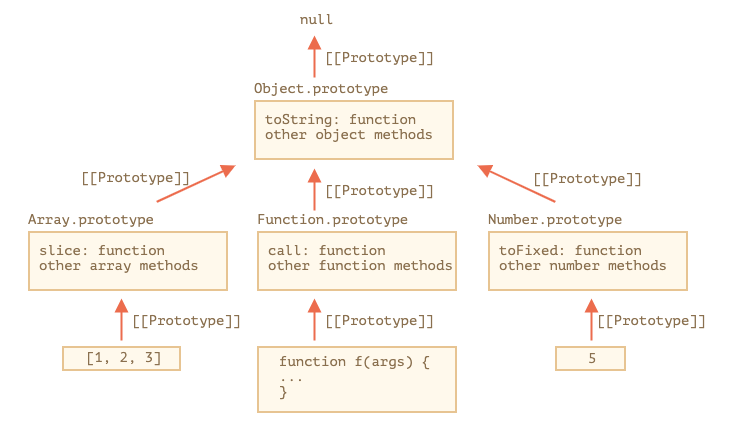

原型Prototype是JavaScript对象继承体系的根基，再怎么说它的重要性都不为过。

在[前面的文章中](https://github.com/Walkerant/Study/blob/master/web/md/js-prototype.md)，已经对原型的概念和使用方式进行了介绍，并且对原型链也进行了讨论。下面，再来谈谈一些更加细节性的问题。

# 原型Prototype
## `F.prototype`

每个函数都有一个属性`prototype`，指向它的原型，只能是对象`object`或者`null`，而不能是其他类型，比如基本类型。

`prototype`只能在调用`new`时使用。如果有动态修改的需求，还可以随时修改，但是在修改之后，并不会修改已经创建的对象的原型，而只能对后续新创建的对象产生影响。

```js
let animal = {
  eats: true
};

function Rabbit(name) {
    this.name = name;
}

Rabbit.prototype = animal;
let rabbit = new Rabbit("One");

let toy = {
    playable: true
}

Rabbit.prototype = toy;
let toyRabbit = new Rabbit("Another")

rabbit.__proto__ === animal // true
toyRabbit.__proto__ === toy // true
```

再来看看另一些例子。在函数对象的原型上直接修改、删除某些属性：

```js
function Rabbit() {}
Rabbit.prototype = {
  eats: true
};

let rabbit = new Rabbit();

// 修改原型对象的属性
Rabbit.prototype.eats = false;

alert( rabbit.eats );   // ① false

// 删除对象属性
delete rabbit.eats;
alert( rabbit.eats );   // ② true

// 删除原型对象上的属性
delete Rabbit.prototype.eats;
alert( rabbit.eats );   // ③ undefined

```

为什么会这样？首先因为：
- 对象的存储是Reference类型，也就是内存地址，如果只修改它的属性，而没有重新赋值，则还是同一个对象，否则就变成另一个对象；
- 原型对象有且仅有一个，用来为所有由它创建的对象共享属性和方法，实现对象之间的继承关系；
- 对象的属性包含它的原型链上的所有对象的属性，但是它只能修改或者删除属于亲自创建的属性，原型链上其他对象的属性只能获取getter

这样，就比较好理解上面例子了：
- ①因为修改了原型，所以后续操作按原型的最新状态执行；
- ②因为eats来自原型，它只能被getter，而不能被删除，所以操作无效；
- ③因为直接删除了原型属性，所以后续操作按原型的最新状态执行，删除之后只能为`undefined`。

## `Object.prototype`

在JavaScript中，所有对象对继承自Object，它的原型是`Object.prototype`，再往上寻找，就成了`null`。

```js
let obj = {};

alert(obj.__proto__ === Object.prototype); // true
alert(Object.prototype.__proto__); // null
```

所有原生对象也都继承自Object，比如Array、Date、Function等，下面是它们的继承关系。



```js
let arr = [1, 2, 3];

alert( arr.__proto__ === Array.prototype ); // true

alert( arr.__proto__.__proto__ === Object.prototype ); // true

// 已经达到继承关系链的顶部
alert( arr.__proto__.__proto__.__proto__ ); // null
```

甚至，我们还可以借用原型方法，比如一个对象需要某个原生对象的内置方法，则可以很容易的实现。

```js
let obj = {
  0: "Hello",
  1: "world!",
  length: 2,
};

obj.join = Array.prototype.join;

alert( obj.join(',') ); // Hello,world!
```

这种方式得以奏效，是因为原生对象Array的方法`join`的实现逻辑，只关注对象索引和`length`属性，它并不管对象是不是真正的Array。可以看出，这就是原型概念的微观呈现，它只关注对象的具体行为，并以此划分类型。

下面，给所有function添加一个方法`defer`，允许它们延迟一定时间之后再执行。

```js
Function.prototype.defer = function(ms) {
  setTimeout(this, ms);
};

function f() {
  alert("Hello!");
}

f.defer(1000); // 1秒之后显示Hello!
```

但是这种方式并不能接受参数，可以结合前面说活的装饰器重新实现。

```js
Function.prototype.defer = function(ms) {
    let f = this;
    return function(...args) {
        setTimeout(() => f.apply(this, args), ms);
    }
}
function f(a, b) {
  alert( a + b );
}

f.defer(1000)(1, 2); // 1秒之后：3
```

