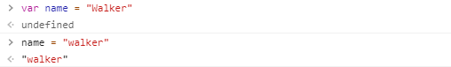

通过前面两节内容，我们已经了解了JavaScript执行机制中的事件循环和执行上下文、闭包、函数、this等内容，这些都是比较粗粒度的代码执行机制，理解了它们便知道了JavaScript代码执行机制的大部分内容。

下面，我们来了解粒度最小的代码单元：语句Statement，看看它有什么特别之处。

## 语句类型
比较常见的语句包括变量声明、表达式、条件、循环等，下面是大体分类。


所有语句的用法和其他语言的用法没有太大区别，但是JavaScript语句的实现机制则有些不同，主要是这里涉及到一种数据类型：Completion，是JavaScript七个语言类型之一。

## Completion
先来看一个例子，在一组try语句中，如果在前面有了return语句，后面finally中的语句还会执行执行吗？

```js
    function foo(){
        try{
            return 0;
        } catch(err) {
            console.log(err);
        } finally {
            console.log("a")
        }
    }

    console.log(foo());
```

通过执行，得知finally中的语句执行了，而且try中的return语句也执行了。这太反直觉了！

如果修改一下上面的例子，在finally中加入return语句，又是什么结果呢？
```js
    function foo(){
        try{
            return 0;
        } catch(err) {
            console.log(err);
        } finally {
            console.log("a")
            return 1;
        }
    }

    console.log(foo());
```

通过执行，得知finally中的return覆盖了try中的return。也就是说，在一个函数中，执行了两次return语句，竟然还有这种操作，这简直让人无法理解！

其实，上面这些行为都是因为Completion Record。在JavaScript中，每条语句的执行完成状态都是由Completion Record类型表示的，它有三个字段：

- [[type]]：表示完成的类型，具体有这些类型：
    - break
    - continue
    - return
    - throw
    - normal
- [[value]]：表示语句的返回值，如果没有，则是empty；
- [[target]] 表示语句的目标，通常是一个JavaScript标签（标签在后文会有介绍）。

JavaScript正是通过Completion Record这一语言类型，实现了复杂的嵌套结构，有时候还让人难以理解。

下面来分别分析众类型语句的Completion Record。

## 普通语句

在普通语句中，都是从前到后顺次执行，没有任何控制和循环逻辑。

普通语句执行后，得到 [[type]] 为 normal 的 Completion Record，JavaScript引擎遇到这样的Completion Record，会继续执行下一条语句。这些语句中，只有表达式语句会产生 [[value]]。

在浏览器自带的调试工具中，如果写用 var 声明一个变量，会返回一个undefined，但是如果只赋值，则返回具体的值，其实就是因为这个原因。



## 语句块

语句块就是拿大括号括起来的一组语句，它是一种语句的复合结构，可以嵌套。比如下面的语句块：

```js
    {
        var i = 1;      // normal, empty, empty
        i ++;           // normal, 1, empty
        console.log(i)  // normal, undefined, empty
    } // normal, undefined, empty
```

后面给出的是每条语句以及整个语句块的Completion Record的三个字段。

语句块本身并不复杂，但是如果其内部的语句的Completion Record的[[type]]不是 normal ，则会打断语句块后续的语句执行流程。

```js
    var fn = function() {
        var i = 1;  // normal, empty, empty
        return i;   // return, 1, empty
        i ++; 
        console.log(i)
    } // return, 1, empty

    fn() // 1
```

假如我们在y语句块中插入了一条return语句，产生了一个非normal记录，那么整个block会成为非normal。这种方式保证了非normal的完成类型可以穿透复杂的语句嵌套结构，从而产生控制效果。

## 控制型语句

控制型语句带有 if、switch关键字，它们会对不同类型的Completion Record产生反应。

控制类语句分成两部分，一类是对其内部造成影响，如if、switch、while/for、try；另一类是对外部造成影响如break、continue、return、throw。这两类语句的配合，会产生控制代码执行顺序和执行逻辑的效果，这也是我们编程的主要工作。

一般来说， for/while 、 break/continue 和 try/throw 这样比较符合逻辑的组合，是我们比较熟悉的，但是，实际上，我们需要控制语句跟break 、continue 、return 、throw四种类型与控制语句两两组合产生的效果。


通过上表中的内容，不难理解前文中的例子。因为finally中的语句必须保证执行，所以当try/catch执行完毕，即使得到了return类型的完成记录，也要执行完finally中的语句。这样，当执行完finally中的语句，才得到最后的结果。

## 带标签的语句

前面说Completion Record类型有三个字段，最后一个为[[target]]，这涉及到JavaScript中的一个语法，带标签的语句。

标签的作用是一方面是为了注释代码，增加代码的可读性；另一方面，与Completion Record中的target相配合，用于跳出多层循环。

```js
    outer: while(true) {
      inner: while(true) {
          break outer;
      }
    }
    console.log("finished")
```

break/continue 语句如果后跟了关键字，会产生带target的完成记录。一旦完成记录带了target，那么只有拥有对应label的循环语句会消费它。

